# Main Usage:
```markdown
0. Stock Price
1. Stock Statement
2. Stock Info 
3. Stock Officers 
4. Stock Calendar 
5. Stock Earnings 
6. Stock Splits 
7. Stock Dividends 
8. Stock Revenue Forecast 
9. Stock Earnings Forecast 
10. Stock Summary 
11. Stock TTM EPS
```

## 0. Stock Price

```python
import defeatbeta_api
from defeatbeta_api.data.ticker import Ticker

ticker = Ticker("TSLA")
ticker.price()
```
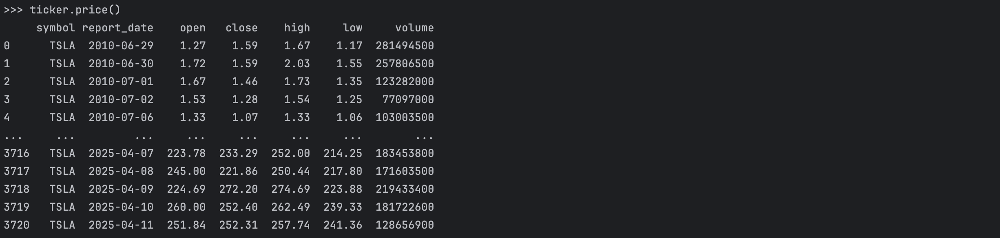

## 1. Stock Statement

```python
# get quarterly income_statement
statement=ticker.quarterly_income_statement()
print(statement.pretty_table())
```
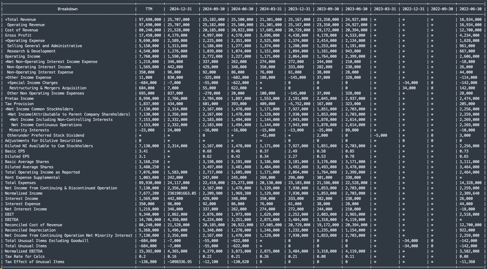

```python
# pandas.DataFrame
ticker.quarterly_income_statement().df()
```
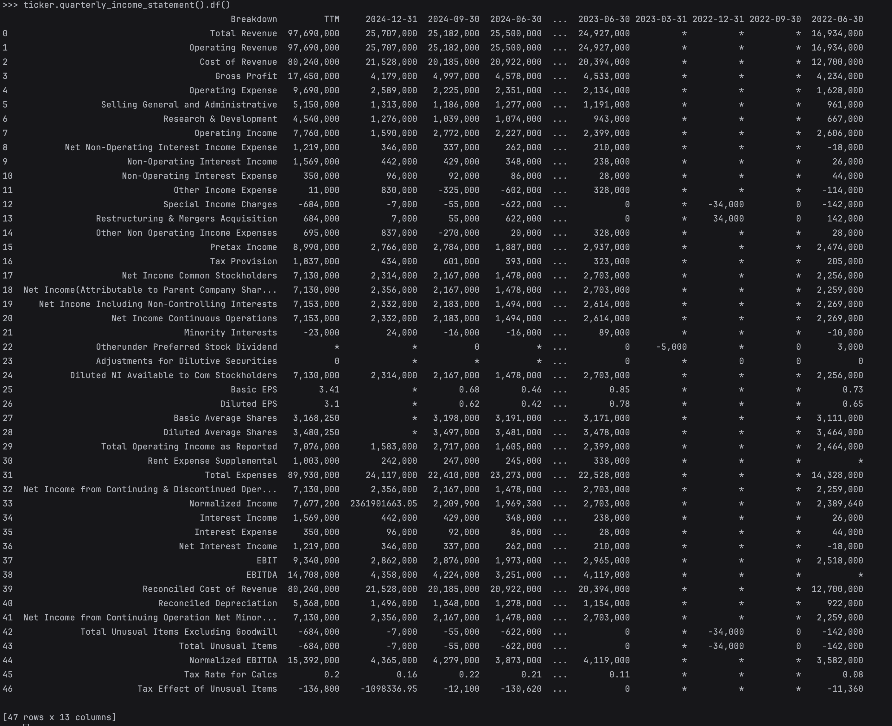


```python
# get annual income_statement
statement=ticker.annual_income_statement()
# get quarterly balance_sheet
statement=ticker.quarterly_balance_sheet()
# get annual balance_sheet
statement=ticker.annual_balance_sheet()
# get quarterly cash_flow
statement=ticker.quarterly_cash_flow()
# get annual cash_flow
statement=ticker.annual_cash_flow()
```

## 2. Stock Info

```python
ticker.info()
```
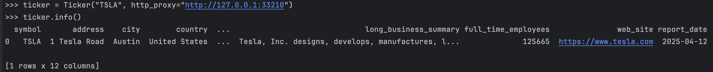

## 3. Stock Officers
```python
ticker.officers()
```
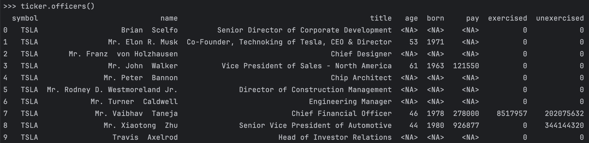

## 4. Stock Calendar
```python
ticker.calendar()
```
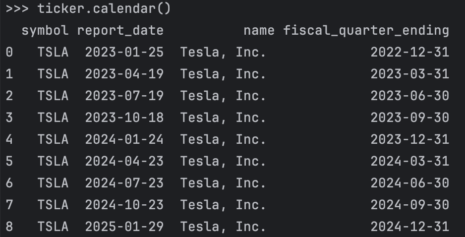

## 5. Stock Earnings
```python
ticker.earnings()
```
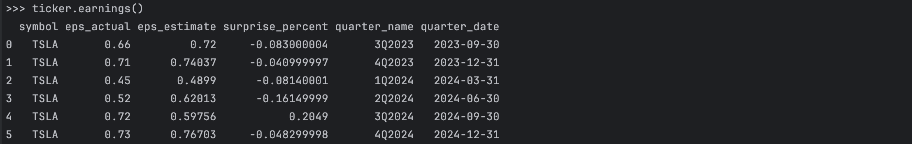

## 6. Stock Splits
```python
ticker.splits()
```
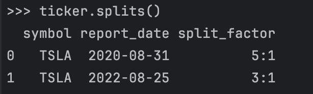

## 7. Stock Dividends
```python
ticker.dividends()
```
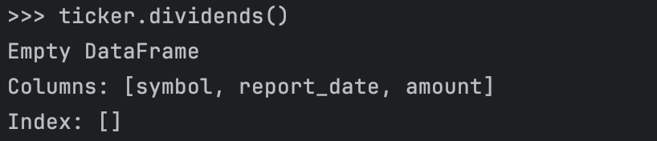

## 8. Stock Revenue Forecast
```python
ticker.revenue_forecast()
```
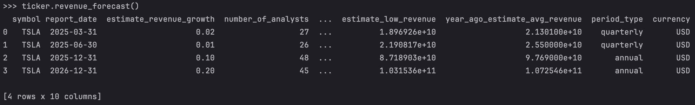

## 9. Stock Earnings Forecast
```python
ticker.earnings_forecast()
```
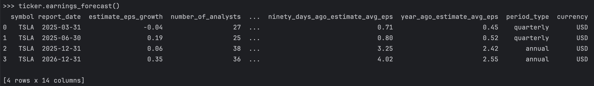

## 10. Stock Summary
```python
ticker.summary()
```
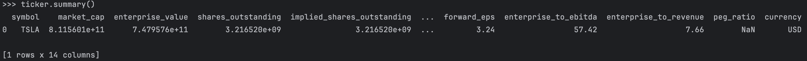

## 11. Stock TTM EPS
```python
ticker.ttm_eps()
```
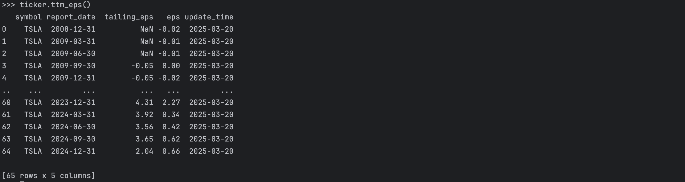