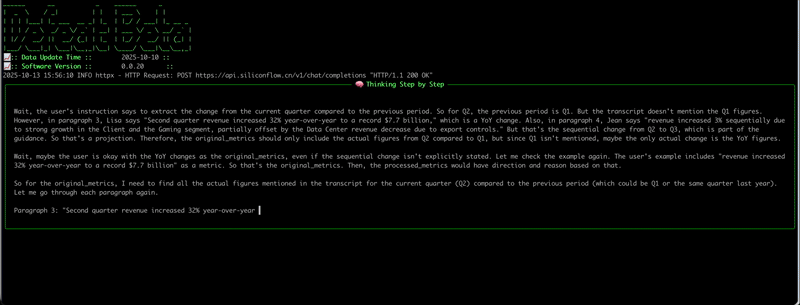

# Example: Using LLMs to Analyze Key Metric Changes and Their Drivers in Earnings Call Transcripts
> [!NOTE]
> Generally speaking, during an earnings call, management will disclose the key financial changes for the quarter and the reasons behind them. These changes are also frequently the focus of repeated questioning and attention from analysts during the Q&A session. Manually reading through the lengthy transcript to analyze these changes and their causes can be very time-consuming.
> 
> This document introduces on how to leverage Large Language Models (LLMs) to analyze these changes and their root causes. In contrast, having an LLM perform the same task takes only tens of seconds and provides a clear, traceable analysis process for your review.


## Prerequisites
To run this example, you need: An OpenAI-compatible API key (`OPEN_AI_API_KEY`), A LLM model with a thinking capability.

Our tests show that even free, small-parameter models(e.g. `Qwen/Qwen3-8B`) can deliver excellent results.

> [!TIP]
> You can obtain a free API for small-parameter models from [SiliconFlow's Chinese website](https://www.siliconflow.cn/pricing).
> 
> For higher accuracy and performance, consider using larger models from [OpenAI](https://openai.com/index/openai-api/), [DeepSeek](https://api-docs.deepseek.com/), [QWen](https://qwen.ai/apiplatform), or [Gemini](https://ai.google.dev/gemini-api/docs).

## Example Code
**Below is an example that analyzes key quarterly financial changes and their causes, using an LLM on earnings call transcripts.**

```python
from openai import OpenAI
from defeatbeta_api.data.ticker import Ticker
from defeatbeta_api.client.openai_conf import OpenAIConfiguration

# Initialize the Ticker
ticker = Ticker("AMD")

# Fetch earnings call transcripts
transcripts = ticker.earning_call_transcripts()

# Configure the OpenAI client
llm = OpenAI(
    api_key="OPEN_AI_API_KEY",  # Replace with your OPEN_AI_API_KEY
    base_url="OPEN_AI_API_END_POINT"  # Replace with your OPEN_AI_API_END_POINT
)

# analyzes key quarterly financial changes and their causes for Q2 2025 with llm
res = transcripts.analyze_financial_metrics_change_for_this_quarter_with_ai(
  2025, 
  2, 
  llm, 
  OpenAIConfiguration(model='Qwen/Qwen3-8B'))
print(res.to_string())
```

---

**The following figure illustrates the thought process of the large model:**



---

**The following is the result of the large model’s reasoning:**

```text
╭───────────────────────────────────────────────────────────────────────────────────────────────── 🧠 Finish Think ──────────────────────────────────────────────────────────────────────────────────────────────────╮
│                                                                                                                                                                                                                    │
│                                                                                                                                                                                                                    │
│  Okay, let's tackle this step by step. First, I need to extract the original metrics from the earnings call transcript. The user mentioned that the original_metrics should include the metric names, change       │
│  descriptions, speaker, and paragraph number. Also, the change field must not include any projections or forecasts, just the actual figures mentioned.                                                             │
│                                                                                                                                                                                                                    │
│  Starting with paragraph 3, Lisa mentions "Second quarter revenue increased 32% year-over-year to a record $7.7 billion." So that's a revenue metric with a 32% increase. The speaker is Lisa T. Su, paragraph 3.  │
│                                                                                                                                                                                                                    │
│  Next, she talks about "over $1 billion in free cash flow." So free cash flow is another metric, increased by more than $1 billion. Still in paragraph 3, same speaker.                                            │
│                                                                                                                                                                                                                    │
│  Then, "Data Center segment revenue increased 14% year-over-year to $3.2 billion." That's a Data Center revenue metric. Speaker Lisa, paragraph 3.                                                                 │
│                                                                                                                                                                                                                    │
│  In paragraph 4, Jean Hu says "revenue increased 3% sequentially due to strong growth in the Client and the Gaming segment." So sequential revenue increase of 3%, but the user wants the change field to be the   │
│  actual figures. Wait, the original_metrics should capture the change from the previous period. The first part of the transcript mentions Q2 revenue was $7.7B, and in paragraph 4, the Q3 guidance is $8.7B. But  │
│  the actual change in the second quarter compared to the previous quarter is mentioned as 3% sequential growth. However, the user specified that the change field should reflect the current quarter's difference  │
│  from the previous period, not the guidance. So in paragraph 4, the sequential increase is 3%, but the actual change in Q2 compared to Q1 isn't directly stated. Wait, the user's instruction says to exclude      │
│  projections, so maybe the sequential increase mentioned in paragraph 4 is part of the actual results? Let me check again.                                                                                         │
│                                                                                                                                                                                                                    │
│  Looking at paragraph 4, Jean says "Revenue increased 3% sequentially due to strong growth in the Client and the Gaming segment, partially offset by the Data Center revenue decrease due to export controls." So  │
│  the sequential increase is 3%, but the actual change from Q1 to Q2 is not explicitly given. Wait, the original_metrics need to capture the change from the previous period. The first paragraph mentions Q2       │
│  revenue is $7.7B, which is a year-over-year increase. But for the sequential change, the user might be referring to Q2 to Q3, but the question is about the original_metrics, which are based on the              │
│  transcript's actual figures. Wait, the original_metrics are for the current quarter, which is Q2. So the change should be the difference between Q2 and Q1. However, the transcript doesn't explicitly state the  │
│  Q1 revenue. Wait, the user's example includes "Second quarter revenue increased 32% year-over-year to a record $7.7 billion," so that's a year-over-year change. But for the sequential change, the transcript    │
│  mentions "revenue increased 3% sequentially" in paragraph 4, but that's part of the guidance for Q3. Wait, the user says to exclude any projections, so maybe the sequential increase mentioned in paragraph 4    │
│  is not part of the actual Q2 results but part of the Q3 guidance. Therefore, the actual Q2 to Q1 change isn't directly stated. Hmm, this is a bit confusing. Let me check again.                                  │
│                                                                                                                                                                                                                    │
│  Wait, the original_metrics are for the current quarter, which is Q2. The change should be the actual figures from the previous period. The transcript mentions that Q2 revenue was $7.7B, which is a 32% YoY      │
│  increase. But the sequential change (Q2 vs Q1) isn't directly given. However, in paragraph 4, Jean says "revenue increased 3% sequentially," which refers to Q3 compared to Q2. So that's part of the guidance,   │
│  not the actual Q2 change. Therefore, maybe the sequential change isn't included in the original_metrics because it's a projection. So perhaps the only actual changes are the YoY figures.                        │
│                                                                                                                                                                                                                    │
│  Wait, the user's instruction says to exclude any projections, guidance, or forecasts. So the sequential increase mentioned in paragraph 4 is part of the guidance for Q3, so it shouldn't be included.            │
│  Therefore, the original_metrics would only include the YoY changes. Let me check other paragraphs.                                                                                                                │
│                                                                                                                                                                                                                    │
│  In paragraph 3, Lisa mentions "Data Center segment revenue increased 14% year-over-year to $3.2 billion." So that's a YoY increase. Then, in paragraph 4, Jean says "Data Center segment revenue decreased 12%    │
│  sequentially due to the impact of the export controls on MI308." But that's a sequential decrease, which is part of the Q3 guidance. So again, that's a projection. So maybe the original_metrics only include    │
│  the actual figures from the current quarter (Q2) compared to the previous quarter (Q1) if they are mentioned. But the transcript doesn't state the Q1 revenue. Wait, the user's example includes "Second quarter  │
│  revenue increased 32% year-over-year to a record $7.7 billion," which is a YoY change. So perhaps the original_metrics should only include the YoY changes, as the sequential changes are part of the guidance.   │
│                                                                                                                                                                                                                    │
│  Wait, the user's instruction says to extract the change from the current quarter compared to the previous period. So for Q2, the previous period is Q1. But the transcript doesn't mention the Q1 figures.        │
│  However, in paragraph 3, Lisa says "Second quarter revenue increased 32% year-over-year to a record $7.7 billion," which is a YoY change. Also, in paragraph 4, Jean says "revenue increased 3% sequentially due  │
│  to strong growth in the Client and the Gaming segment, partially offset by the Data Center revenue decrease due to export controls." But that's the sequential change from Q2 to Q3, which is part of the         │
│  guidance. So that's a projection. Therefore, the original_metrics should only include the actual figures from Q2 compared to Q1, but since Q1 isn't mentioned, maybe the only actual change is the YoY figures.   │
│                                                                                                                                                                                                                    │
│  Wait, maybe the user is okay with the YoY changes as the original_metrics, even if the sequential change isn't explicitly stated. Let me check the example again. The user's example includes "revenue increased  │
│  32% year-over-year to a record $7.7 billion" as a metric. So that's the original_metrics. Then, the processed_metrics would have direction and reason based on that.                                              │
│                                                                                                                                                                                                                    │
│  So for the original_metrics, I need to find all the actual figures mentioned in the transcript for the current quarter (Q2) compared to the previous period (which could be Q1 or the same quarter last year).    │
│  Let me go through each paragraph again.                                                                                                                                                                           │
│                                                                                                                                                                                                                    │
│  Paragraph 3: "Second quarter revenue increased 32% year-over-year to a record $7.7 billion" – that's a YoY increase. So that's one metric: Revenue, change is "increased 32% year-over-year to a record $7.7      │
│  billion", speaker Lisa, paragraph 3.                                                                                                                                                                              │
│                                                                                                                                                                                                                    │
│  "Free cash flow was over $1 billion" – that's a metric. So Free Cash Flow, change is "over $1 billion", speaker Lisa, paragraph 3.                                                                                │
│                                                                                                                                                                                                                    │
│  "Data Center segment revenue increased 14% year-over-year to $3.2 billion" – Data Center Revenue, 14% YoY increase, speaker Lisa, paragraph 3.                                                                    │
│                                                                                                                                                                                                                    │
│  "EPYC segment revenue increased 14% year-over-year to $3.2 billion" – Wait, the paragraph says "Data Center segment revenue increased 14% year-over-year to $3.2 billion. We saw robust demand across our EPYC    │
│  portfolio..." So maybe the EPYC segment is part of the Data Center segment? Or is there a separate metric for EPYC? The user's example includes "EPYC and Ryzen processor sales" as part of the revenue. But the  │
│  original_metrics need to be specific. Let me check the exact wording.                                                                                                                                             │
│                                                                                                                                                                                                                    │
│  In paragraph 3: "Data Center segment revenue increased 14% year-over-year to $3.2 billion. We saw robust demand across our EPYC portfolio..." So the Data Center segment's revenue is $3.2B, up 14% YoY. Then,    │
│  "EPYC adoption also grew with telecom customers..." but that's not a metric.                                                                                                                                      │
│                                                                                                                                                                                                                    │
│  In paragraph 3, "EPYC and Ryzen CPU sales" – but the exact metric is "revenue exceeding the midpoint of guidance as higher EPYC and Ryzen processor sales more than offset headwinds from export controls that    │
│  impacted Instinct sales." So the revenue is the main metric here.                                                                                                                                                 │
│                                                                                                                                                                                                                    │
│  Then, in paragraph 3, "we delivered over $1 billion in free cash flow." So that's a metric.                                                                                                                       │
│                                                                                                                                                                                                                    │
│  In paragraph 3, "Excluding the $800 million inventory write-down related to data center AI export controls, gross margin was 54%, marking our sixth consecutive quarter of year-over-year margin expansion led    │
│  by a richer product mix." So the gross margin is 54%, which is a change from the previous quarter's gross margin. But the previous quarter's gross margin isn't mentioned. Wait, the user's example includes      │
│  "gross margin was 54%, marking our sixth consecutive quarter of year-over-year margin expansion." So that's a gross margin metric, with the change being "marking our sixth consecutive quarter of                │
│  year-over-year margin expansion led by a richer product mix." But the actual numerical change isn't given. Wait, the original_metrics require the change field to have the numerical figures. So maybe the gross  │
│  margin is 54% in Q2, and the previous quarter's gross margin was 53%? Wait, in paragraph 4, Jean says "Gross margin was 43%, down 10 points from 53% a year ago." So that's a YoY change. But the                 │
│  original_metrics are for the current quarter's change from the previous period. So if the current quarter is Q2, the previous period could be Q1 or Q2 of the prior year.                                         │
│                                                                                                                                                                                                                    │
│  Wait, the user's example includes "Second quarter revenue increased 32% year-over-year to a record $7.7 billion" as a metric. So the change is the YoY increase. Similarly, "gross margin was 54%, marking our    │
│  sixth consecutive quarter of year-over-year margin expansion led by a richer product mix." So that's a gross margin metric, with the change being the 54% figure and the year-over-year expansion.                │
│                                                                                                                                                                                                                    │
│  So for original_metrics, I need to extract each metric mentioned with its change, speaker, and paragraph number. Let me list all possible metrics:                                                                │
│                                                                                                                                                                                                                    │
│  1. Revenue: increased 32% YoY to $7.7B (Lisa, paragraph 3)                                                                                                                                                        │
│  2. Free Cash Flow: over $1B (Lisa, paragraph 3)                                                                                                                                                                   │
│  3. Data Center segment revenue: increased 14% YoY to $3.2B (Lisa, paragraph 3)                                                                                                                                    │
│  4. Gross margin: 54% (Lisa, paragraph 3)                                                                                                                                                                          │
│  5. Client and Gaming segment revenue: increased 69% YoY to $3.6B (Lisa, paragraph 3)                                                                                                                              │
│  6. Client revenue: increased 67% YoY to $2.5B (Lisa, paragraph 3)                                                                                                                                                 │
│  7. Gaming revenue: increased 73% YoY to $1.1B (Lisa, paragraph 3)                                                                                                                                                 │
│  8. Embedded segment revenue: decreased 4% YoY to $824M (Lisa, paragraph 3)                                                                                                                                        │
│  9. MI350 series: launched, but no specific metric here. Wait, the MI350 series is mentioned in the context of ramping, but the actual metric might be the revenue from MI350. However, the transcript doesn't     │
│  state the MI350 revenue yet. The only mention is that the Data Center segment revenue is $3.2B, which includes MI350. But the exact change for MI350 isn't given.                                                 │
│                                                                                                                                                                                                                    │
│  Wait, the user's instruction says to extract the change as per management's statement. So if the Data Center segment revenue is $3.2B, which is up 14% YoY, but the MI350 is part of that. However, the           │
│  original_metrics should be specific. Maybe the MI350 is a product line, but the revenue is part of the Data Center segment. So perhaps the MI350 isn't a separate metric here.                                    │
│                                                                                                                                                                                                                    │
│  Also, in paragraph 4, Jean mentions "non-GAAP gross margin would have been approximately 54%." So that's the same as the previous mention.                                                                        │
│                                                                                                                                                                                                                    │
│  Then, in paragraph 4, "Data Center segment revenue decreased 12% sequentially due to the impact of the export controls on MI308." But that's part of the Q3 guidance, so it's a projection. So not included in    │
│  original_metrics.                                                                                                                                                                                                 │
│                                                                                                                                                                                                                    │
│  Other metrics: "Client and Gaming segment revenue was $3.6 billion, up 69% year-over-year and 20% sequentially." But the sequential part is part of the Q3 guidance.                                              │
│                                                                                                                                                                                                                    │
│  So the original_metrics would include the YoY changes. Let me check again for any other metrics.                                                                                                                  │
│                                                                                                                                                                                                                    │
│  In paragraph 3, "we set records for both EPYC and Ryzen CPU sales" – but that's a qualitative statement, not a numerical change.                                                                                  │
│                                                                                                                                                                                                                    │
│  In paragraph 3, "EPYC segment revenue increased 14% year-over-year to $3.2 billion." Wait, the Data Center segment is mentioned, but maybe EPYC is a sub-segment. However, the user's example includes "EPYC and  │
│  Ryzen processor sales" as part of the revenue. But the exact metric for EPYC might be part of the Data Center segment.                                                                                            │
│                                                                                                                                                                                                                    │
│  Also, in paragraph 3, "we delivered over $1 billion in free cash flow." So that's a metric.                                                                                                                       │
│                                                                                                                                                                                                                    │
│  In paragraph 4, "Gross margin was 43%, down 10 points from 53% a year ago." So that's a gross margin metric, but the change is the 43% figure. Wait, the original_metrics should have the change as the actual    │
│  figures. So the gross margin in Q2 is 43%, which is a decrease from 53% YoY. But the user's example includes "gross margin was 54%, marking our sixth consecutive quarter of year-over-year margin expansion."    │
│  Wait, that's conflicting. Let me check the exact wording again.                                                                                                                                                   │
│                                                                                                                                                                                                                    │
│  In paragraph 3: "Excluding the $800 million inventory write-down related to data center AI export controls, gross margin was 54%, marking our sixth consecutive quarter of year-over-year margin expansion led    │
│  by a richer product mix." So the gross margin is 54% in Q2, which is a YoY increase. But the actual previous quarter's gross margin isn't stated. However, the user's example includes "marking our sixth         │
│  consecutive quarter of year-over-year margin expansion," which implies that the previous quarter's gross margin was lower. But the exact number isn't given. Wait, but in paragraph 4, Jean says "Gross margin    │
│  was 43%, down 10 points from 53% a year ago." So that's a YoY decrease. But that's for Q2. Wait, this is confusing. Let me parse this carefully.                                                                  │
│                                                                                                                                                                                                                    │
│  In paragraph 3, Lisa says "gross margin was 54%... sixth consecutive quarter of year-over-year margin expansion." So that's a YoY increase. But in paragraph 4, Jean says "Gross margin was 43%, down 10 points   │
│  from 53% a year ago." Wait, that seems contradictory. Wait, maybe the 54% is the non-GAAP gross margin, and the 43% is the GAAP gross margin. Because in paragraph 4, Jean mentions "non-GAAP gross margin would  │
│  have been approximately 54%." So the GAAP gross margin is 43%, which is down from 53% YoY. But the original_metrics should include the change as per the transcript. So the GAAP gross margin is 43%, down 10     │
│  points from 53% YoY. But the non-GAAP is 54%, which is an expansion. So maybe the original_metrics should include both GAAP and non-GAAP? But the user's example includes "gross margin was 54%," so perhaps the  │
│  non-GAAP is the one they want.                                                                                                                                                                                    │
│                                                                                                                                                                                                                    │
│  This is getting a bit tangled. Let me focus on the metrics that are explicitly stated with numerical changes.                                                                                                     │
│                                                                                                                                                                                                                    │
│  So, the original_metrics would be:                                                                                                                                                                                │
│                                                                                                                                                                                                                    │
│  1. Revenue: increased 32% YoY to $7.7B (Lisa, paragraph 3)                                                                                                                                                        │
│  2. Free Cash Flow: over $1B (Lisa, paragraph 3)                                                                                                                                                                   │
│  3. Data Center segment revenue: increased 14% YoY to $3.2B (Lisa, paragraph 3)                                                                                                                                    │
│  4. Gross margin (non-GAAP): 54% (Lisa, paragraph 3)                                                                                                                                                               │
│  5. Client and Gaming segment revenue: increased 69% YoY to $3.6B (Lisa, paragraph 3)                                                                                                                              │
│  6. Client revenue: increased 67% YoY to $2.5B (Lisa, paragraph 3)                                                                                                                                                 │
│  7. Gaming revenue: increased 73% YoY to $1.1B (Lisa, paragraph 3)                                                                                                                                                 │
│  8. Embedded segment revenue: decreased 4% YoY to $824M (Lisa, paragraph 3)                                                                                                                                        │
│  9. Gross margin (GAAP): 43%, down 10 points from 53% YoY (Jean, paragraph 4)                                                                                                                                      │
│  10. Operating income: $897 million, 12% operating margin (Jean, paragraph 4)                                                                                                                                      │
│  11. Diluted earnings per share: $0.48 vs $0.69 YoY (Jean, paragraph 4)                                                                                                                                            │
│  12. MI350 series: launched, but no specific revenue figure. However, in paragraph 18, Lisa mentions "MI355" and "MI350 series" but not the exact revenue.                                                         │
│                                                                                                                                                                                                                    │
│  Wait, the user's instruction says to extract the change from the previous period. So for the MI350, the transcript mentions that they started volume production in June and expect a steep production ramp in     │
│  the second half. But that's a projection. So the actual change for MI350 isn't given.                                                                                                                             │
│                                                                                                                                                                                                                    │
│  So the original_metrics would include the ones with explicit numbers. Let me list them again:                                                                                                                     │
│                                                                                                                                                                                                                    │
│  - Revenue: 32% YoY to $7.7B (Lisa, para 3)                                                                                                                                                                        │
│  - Free Cash Flow: over $1B (Lisa, para 3)                                                                                                                                                                         │
│  - Data Center segment revenue: 14% YoY to $3.2B (Lisa, para 3)                                                                                                                                                    │
│  - Gross margin (non-GAAP): 54% (Lisa, para 3)                                                                                                                                                                     │
│  - Client and Gaming segment revenue: 69% YoY to $3.6B (Lisa, para 3)                                                                                                                                              │
│  - Client revenue: 67% YoY to $2.5B (Lisa, para 3)                                                                                                                                                                 │
│  - Gaming revenue: 73% YoY to $1.1B (Lisa, para 3)                                                                                                                                                                 │
│  - Embedded segment revenue: 4% YoY decrease to $824M (Lisa, para 3)                                                                                                                                               │
│  - GAAP gross margin: 43%, down 10 points from 53% YoY (Jean, para 4)                                                                                                                                              │
│  - Operating income: $897M, 12% margin (Jean, para 4)                                                                                                                                                              │
│  - Diluted EPS: $0.48 vs $0.69 YoY (Jean, para 4)                                                                                                                                                                  │
│  - Free cash flow: $1.2B (from paragraph 4, but that's the same as the previous mention? Wait, in paragraph 3, it's "over $1 billion in free cash flow," and in paragraph 4, "we generated $1.5 billion in cash    │
│  from operating activities of continuing operations, and free cash flow was a record of $1.2 billion." So that's a different figure. Wait, but the user's original_metrics should be based on the current          │
│  quarter's change. So the free cash flow in Q2 is $1.2B, which is a record. But the change from the previous quarter isn't mentioned. So maybe that's not a change but a record.                                   │
│                                                                                                                                                                                                                    │
│  Wait, the user's instruction says the change field should reflect the wording from management's statement, along with numerical figures, but not projections. So for free cash flow, the change is "over $1       │
│  billion" in Q2, but the previous quarter's figure isn't given. However, in paragraph 4, Jean says "free cash flow was a record of $1.2 billion." So that's the actual figure. But the change from the previous    │
│  quarter isn't specified. So maybe that's not a change but a record.                                                                                                                                               │
│                                                                                                                                                                                                                    │
│  This is tricky. Let me focus on the metrics that have a clear comparison.                                                                                                                                         │
│                                                                                                                                                                                                                    │
│  So, the original_metrics would include:                                                                                                                                                                           │
│                                                                                                                                                                                                                    │
│  1. Revenue: 32% YoY increase to $7.7B (Lisa, para 3)                                                                                                                                                              │
│  2. Free Cash Flow: over $1B (Lisa, para 3)                                                                                                                                                                        │
│  3. Data Center segment revenue: 14% YoY increase to $3.2B (Lisa, para 3)                                                                                                                                          │
│  4. Gross margin (non-GAAP): 54% (Lisa, para 3)                                                                                                                                                                    │
│  5. Client and Gaming segment revenue: 69% YoY increase to $3.6B (Lisa, para 3)                                                                                                                                    │
│  6. Client revenue: 67% YoY increase to $2.5B (Lisa, para 3)                                                                                                                                                       │
│  7. Gaming revenue: 73% YoY increase to $1.1B (Lisa, para 3)                                                                                                                                                       │
│  8. Embedded segment revenue: 4% YoY decrease to $824M (Lisa, para 3)                                                                                                                                              │
│  9. GAAP gross margin: 43%, down 10 points from 53% YoY (Jean, para 4)                                                                                                                                             │
│  10. Operating income: $897M, 12% margin (Jean, para 4)                                                                                                                                                            │
│  11. Diluted EPS: $0.48 vs $0.69 YoY (Jean, para 4)                                                                                                                                                                │
│  12. Free cash flow: $1.2B (Jean, para 4)                                                                                                                                                                          │
│                                                                                                                                                                                                                    │
│  Wait, but the free cash flow in paragraph 3 is "over $1 billion" and in paragraph 4 it's "free cash flow was a record of $1.2 billion." So that's a change from the previous quarter. But the previous quarter's  │
│  figure isn't given. However, the user's instruction says to include the change as per the transcript. So if the current quarter's free cash flow is a record, that's a change from the previous quarter. But the  │
│  exact numerical change (like percentage) isn't mentioned. So maybe the change is "record of $1.2 billion" but that's not a percentage.                                                                            │
│                                                                                                                                                                                                                    │
│  Hmm. The user's example includes "revenue increased 32% year-over-year to a record $7.7 billion" as a metric. So the change is the percentage and the absolute figure. So for free cash flow, the change is       │
│  "over $1 billion" (from paragraph 3) and "record of $1.2 billion" (from paragraph 4). Wait, but the paragraph 4 mentions "free cash flow was a record of $1.2 billion," which is the same as the previous         │
│  mention? Or is that a different figure?                                                                                                                                                                           │
│                                                                                                                                                                                                                    │
│  Wait, in paragraph 3, Lisa says "we delivered over $1 billion in free cash flow." Then in paragraph 4, Jean says "free cash flow was a record of $1.2 billion." So that's an increase from the previous quarter.  │
│  But the exact change (percentage) isn't given. So the change would be "record of $1.2 billion" but that's not a percentage. However, the user's example includes both percentage and absolute figures. So maybe   │
│  the change is "over $1 billion" and "record of $1.2 billion" as separate metrics? Or is it the same metric with different figures?                                                                                │
│                                                                                                                                                                                                                    │
│  This is getting complicated. Let me try to list all the metrics with their changes as per the transcript, ensuring that the change is the actual figure mentioned, not projections.                               │
│                                                                                                                                                                                                                    │
│  So, for the original_metrics:                                                                                                                                                                                     │
│                                                                                                                                                                                                                    │
│  - Revenue: increased 32% YoY to $7.7B (Lisa, para 3)                                                                                                                                                              │
│  - Free Cash Flow: over $1B (Lisa, para 3)                                                                                                                                                                         │
│  - Data Center segment revenue: increased 14% YoY to $3.2B (Lisa, para 3)                                                                                                                                          │
│  - Gross margin (non-GAAP): 54% (Lisa, para 3)                                                                                                                                                                     │
│  - Client and Gaming segment revenue: increased 69% YoY to $3.6B (Lisa, para 3)                                                                                                                                    │
│  - Client revenue: increased 67% YoY to $2.5B (Lisa, para 3)                                                                                                                                                       │
│  - Gaming revenue: increased 73% YoY to $1.1B (Lisa, para 3)                                                                                                                                                       │
│  - Embedded segment revenue: decreased 4% YoY to $824M (Lisa, para 3)                                                                                                                                              │
│  - GAAP gross margin: 43%, down 10 points from 53% YoY (Jean, para 4)                                                                                                                                              │
│  - Operating income: $897M, 12% margin (Jean, para 4)                                                                                                                                                              │
│  - Diluted EPS: $0.48 vs $0.69 YoY (Jean, para 4)                                                                                                                                                                  │
│  - Free cash flow: record of $1.2B (Jean, para 4)                                                                                                                                                                  │
│                                                                                                                                                                                                                    │
│  Wait, but the free cash flow in paragraph 3 is "over $1 billion" and in paragraph 4 it's "record of $1.2 billion." So that's a change from the previous quarter. But the exact percentage isn't given. So the     │
│  change would be "record of $1.2 billion" but that's not a percentage. However, the user's example includes both percentage and absolute figures. So maybe the change is "over $1 billion" and "record of $1.2     │
│  billion" as separate entries? Or is it the same metric with different figures?                                                                                                                                    │
│                                                                                                                                                                                                                    │
│  Alternatively, maybe the free cash flow is a single metric, and the change is "record of $1.2 billion" which implies an increase from the previous quarter. But without the previous quarter's figure, it's hard  │
│  to quantify. However, the user's instruction says to include the change as per the transcript, so if the transcript says "record of $1.2 billion," that's the change.                                             │
│                                                                                                                                                                                                                    │
│  So compiling all these, the original_metrics would have these entries. Now, for the processed_metrics, I need to infer direction and reason for each.                                                             │
│                                                                                                                                                                                                                    │
│  For example, the revenue increased 32% YoY, so direction is "up," and the reason is "higher EPYC and Ryzen processor sales more than offset headwinds from export controls that impacted Instinct sales."         │
│                                                                                                                                                                                                                    │
│  Similarly, the Data Center segment revenue increased 14% YoY, so direction is "up," and the reason is "robust demand across our EPYC portfolio to power cloud and enterprise workloads and increasingly for       │
│  emerging AI use cases."                                                                                                                                                                                           │
│                                                                                                                                                                                                                    │
│  The free cash flow is "over $1 billion" which is an increase, so direction "up," and the reason might be "sustained demand for our prior-generation EPYC processors" or something else. Wait, the reason for the  │
│  free cash flow increase isn't explicitly stated, but the context is that they had a record free cash flow. So the reason could be "sustained demand for EPYC and Ryzen processors, and strong performance in the  │
│  Data Center and Client segments."                                                                                                                                                                                 │
│                                                                                                                                                                                                                    │
│  But the user says the reason should be derived from the full transcript and use management's own wording. So for each metric, I need to find the reason mentioned.                                                │
│                                                                                                                                                                                                                    │
│  For example, the Data Center segment revenue increase is due to "robust demand across our EPYC portfolio to power cloud and enterprise workloads and increasingly for emerging AI use cases."                     │
│                                                                                                                                                                                                                    │
│  The Client and Gaming segment revenue increase is due to "record client CPU sales and strong demand for our semi-custom game console SoCs and Radeon GPUs."                                                       │
│                                                                                                                                                                                                                    │
│  The Embedded segment revenue decreased due to "demand continues recovering gradually with sell-through in the second quarter picking up as strength in most markets was offset by a few pockets of softness in    │
│  inventory reduction actions largely with industrial customers."                                                                                                                                                   │
│                                                                                                                                                                                                                    │
│  The GAAP gross margin decreased by 10 points from 53% YoY, so direction "down," and the reason is "the $800 million inventory and related charges associated with the export restrictions."                       │
│                                                                                                                                                                                                                    │
│  Operating income decreased to $897M, so direction "down," and the reason is "inventory and related charges."                                                                                                      │
│                                                                                                                                                                                                                    │
│  Diluted EPS decreased by $0.21, so direction "down," and the reason is "inventory and related charges."                                                                                                           │
│                                                                                                                                                                                                                    │
│  The free cash flow is a record, so direction "up," and the reason might be "strong momentum across the business and sustained demand for products."                                                               │
│                                                                                                                                                                                                                    │
│  I need to make sure each processed metric corresponds exactly to the original_metrics. Also, the direction must be "up," "down," or "unchanged."                                                                  │
│                                                                                                                                                                                                                    │
│  Now, compiling all this into the original_metrics and processed_metrics arrays. Let me check each paragraph again to ensure I didn't miss any metrics.                                                            │
│                                                                                                                                                                                                                    │
│  In paragraph 3, there's also mention of "we set records for both EPYC and Ryzen CPU sales," but that's a qualitative statement.                                                                                   │
│                                                                                                                                                                                                                    │
│  In paragraph 3, "we delivered over $1 billion in free cash flow" and "free cash flow was a record of $1.2 billion" in paragraph 4. Wait, that's conflicting. Wait, paragraph 3 says "we delivered over $1         │
│  billion in free cash flow" and paragraph 4 says "free cash flow was a record of $1.2 billion." So the free cash flow in Q2 is $1.2B, which is a record. So the change is "record of $1.2 billion," but the        │
│  previous quarter's figure isn't given. However, the user's instruction says to include the change as per the transcript. So the change for free cash flow is "record of $1.2 billion," which implies an increase  │
│  from the previous quarter.                                                                                                                                                                                        │
│                                                                                                                                                                                                                    │
│  So the original_metrics would have:                                                                                                                                                                               │
│                                                                                                                                                                                                                    │
│  1. Revenue: "increased 32% year-over-year to a record $7.7 billion" (Lisa, para 3)                                                                                                                                │
│  2. Free Cash Flow: "record of $1.2 billion" (Jean, para 4)                                                                                                                                                        │
│  3. Data Center segment revenue: "increased 14% year-over-year to $3.2 billion" (Lisa, para 3)                                                                                                                     │
│  4. Gross margin (non-GAAP): "54%, marking our sixth consecutive quarter of year-over-year margin expansion" (Lisa, para 3)                                                                                        │
│  5. Client and Gaming segment revenue: "increased 69% year-over-year to $3.6 billion" (Lisa, para 3)                                                                                                               │
│  6. Client revenue: "increased 67% year-over-year to $2.5 billion" (Lisa, para 3)                                                                                                                                  │
│  7. Gaming revenue: "increased 73% year-over-year to $1.1 billion" (Lisa, para 3)                                                                                                                                  │
│  8. Embedded segment revenue: "decreased 4% year-over-year to $824 million" (Lisa, para 3)                                                                                                                         │
│  9. GAAP gross margin: "43%, down 10 points from 53% a year ago" (Jean, para 4)                                                                                                                                    │
│  10. Operating income: "$897 million, representing a 12% operating margin compared to $1.3 billion or 22% a year ago" (Jean, para 4)                                                                               │
│  11. Diluted EPS: "$0.48 compared to $0.69 a year ago" (Jean, para 4)                                                                                                                                              │
│  12. Free cash flow: "record of $1.2 billion" (Jean, para 4)                                                                                                                                                       │
│                                                                                                                                                                                                                    │
│  Wait, but the free cash flow is mentioned in both paragraphs 3 and 4. So maybe it's the same metric. But the user wants the original_metrics to have the change from the previous period. So if the free cash     │
│  flow in Q2 is $1.2B, and the previous quarter's figure isn't given, but the transcript says "record," then the change is "record of $1.2 billion."                                                                │
│                                                                                                                                                                                                                    │
│  But the user's example includes "revenue increased 32% year-over-year to a record $7.7 billion" as a metric. So the change is the percentage and the absolute figure.                                             │
│                                                                                                                                                                                                                    │
│  So for the free cash flow, the change is "record of $1.2 billion," which is an increase.                                                                                                                          │
│                                                                                                                                                                                                                    │
│  Now, for the processed_metrics, each must have the same name as original_metrics, direction, and reason.                                                                                                          │
│                                                                                                                                                                                                                    │
│  For example:                                                                                                                                                                                                      │
│                                                                                                                                                                                                                    │
│  - Revenue: direction "up," reason "higher EPYC and Ryzen processor sales more than offset headwinds from export controls that impacted Instinct sales."                                                           │
│  - Free Cash Flow: direction "up," reason "strong momentum across the business and sustained demand for products."                                                                                                 │
│  - Data Center segment revenue: direction "up," reason "robust demand across our EPYC portfolio to power cloud and enterprise workloads and increasingly for emerging AI use cases."                               │
│  - Gross margin (non-GAAP): direction "up," reason "a richer product mix."                                                                                                                                         │
│  - Client and Gaming segment revenue: direction "up," reason "record client CPU sales and strong demand for our semi-custom game console SoCs and Radeon GPUs."                                                    │
│  - Client revenue: direction "up," reason "record desktop CPU sales and a richer product mix."                                                                                                                     │
│  - Gaming revenue: direction "up," reason "strong demand for our newly launched gaming GPUs and higher semi-custom revenue as inventory has now normalized and the customers prepare for the holiday season."      │
│  - Embedded segment revenue: direction "down," reason "demand continues recovering gradually with sell-through in the second quarter picking up as strength in most markets was offset by a few pockets of         │
│  softness in inventory reduction actions largely with industrial customers."                                                                                                                                       │
│  - GAAP gross margin: direction "down," reason "the $800 million inventory and related charges associated with the export restrictions."                                                                           │
│  - Operating income: direction "down," reason "inventory and related charges."                                                                                                                                     │
│  - Diluted EPS: direction "down," reason "inventory and related charges."                                                                                                                                          │
│                                                                                                                                                                                                                    │
│  Wait, but the operating income in Q2 is $897M, which is a decrease from $1.3B in Q2 of the previous year. So direction is "down," and the reason is the inventory charges.                                        │
│                                                                                                                                                                                                                    │
│  Similarly, the diluted EPS is $0.48 vs $0.69, so direction "down," reason "inventory and related charges."                                                                                                        │
│                                                                                                                                                                                                                    │
│  Now, compiling all these into the JSON structure. Also, the original_metrics must have the same number of elements as processed_metrics, and each processed metric must correspond exactly to the original.       │
│                                                                                                                                                                                                                    │
│  I need to make sure that each original metric has a processed metric with the same name.                                                                                                                          │
│                                                                                                                                                                                                                    │
│  So the final original_metrics array would have the metrics with their respective changes, speakers, and paragraph numbers. Then, the processed_metrics would have the direction and reason for each.              │
│                                                                                                                                                                                                                    │
│  I think that's all. Now, I'll structure the JSON accordingly.                                                                                                                                                     │
│                                                                                                                                                                                                                    │
│                                                                                                                                                                                                                    │
╰────────────────────────────────────────────────────────────────────────────────────────────────────────────────────────────────────────────────────────────────────────────────────────────────────────────────────╯
```

-----

**The following shows the key data changes and their reasons identified by the large model:**

```text
   symbol  fiscal_year  fiscal_quarter     speaker  paragraph_number               key_financial_metric direction                                                                                                     change                                                                                                                                                                                                                         reason
0     AMD         2025               2  Lisa T. Su                 3                            Revenue        up                                                      increased 32% year-over-year to a record $7.7 billion                                                                                                             higher EPYC and Ryzen processor sales more than offset headwinds from export controls that impacted Instinct sales
1     AMD         2025               2  Lisa T. Su                 3                     Free Cash Flow        up                                                                                            over $1 billion                                                                                                                                                          strong momentum across the business and sustained demand for products
2     AMD         2025               2  Lisa T. Su                 3        Data Center segment revenue        up                                                               increased 14% year-over-year to $3.2 billion                                                                                                     robust demand across our EPYC portfolio to power cloud and enterprise workloads and increasingly for emerging AI use cases
3     AMD         2025               2  Lisa T. Su                 3            Gross margin (non-GAAP)        up  54%, marking our sixth consecutive quarter of year-over-year margin expansion led by a richer product mix                                                                                                                                                                                                           a richer product mix
4     AMD         2025               2  Lisa T. Su                 3  Client and Gaming segment revenue        up                                                               increased 69% year-over-year to $3.6 billion                                                                                                                                record client CPU sales and strong demand for our semi-custom game console SoCs and Radeon GPUs
5     AMD         2025               2  Lisa T. Su                 3                     Client revenue        up                                                               increased 67% year-over-year to $2.5 billion                                                                                                                                                                              record desktop CPU sales and a richer product mix
6     AMD         2025               2  Lisa T. Su                 3                     Gaming revenue        up                                                               increased 73% year-over-year to $1.1 billion                                                               strong demand for our newly launched gaming GPUs and higher semi-custom revenue as inventory has now normalized and the customers prepare for the holiday season
7     AMD         2025               2  Lisa T. Su                 3           Embedded segment revenue      down                                                                decreased 4% year-over-year to $824 million  demand continues recovering gradually with sell-through in the second quarter picking up as strength in most markets was offset by a few pockets of softness in inventory reduction actions largely with industrial customers
8     AMD         2025               2  Jean X. Hu                 4                  GAAP gross margin      down                                                                    43%, down 10 points from 53% a year ago                                                                                                                                         the $800 million inventory and related charges associated with the export restrictions
9     AMD         2025               2  Jean X. Hu                 4                   Operating income      down               $897 million, representing a 12% operating margin compared to $1.3 billion or 22% a year ago                                                                                                                                                                                                  inventory and related charges
10    AMD         2025               2  Jean X. Hu                 4         Diluted earnings per share      down                                                                         $0.48 compared to $0.69 a year ago                                                                                                                                                                                                  inventory and related charges
11    AMD         2025               2  Jean X. Hu                 4                     Free cash flow        up                                                                                     record of $1.2 billion                                                                                                                                                          strong momentum across the business and sustained demand for products
```


## Supported LLM Models
This feature leverages the function-calling capabilities of large language models, so it requires a model with this functionality to work successfully. Fortunately, most large language models support this feature.

Currently supported models include:

| Series       | Models                                                                                                                                                                                       |
|--------------|----------------------------------------------------------------------------------------------------------------------------------------------------------------------------------------------|
| **DeepSeek** | DeepSeek-V3, DeepSeek-V3.1, DeepSeek-R1-0528, DeepSeek-R1 (partial environments)                                                                                                             |
| **Qwen**     | Qwen-2.5 (e.g., Qwen-2.5-7B), Qwen-Plus, Qwen-Max, Qwen-Flash, Qwen-Turbo, Qwen3                                                                                                             |
| **OpenAI**   | GPT-4 series (e.g., gpt-4, gpt-4o), o3, o3-mini, o4-mini, gpt-oss-20B, gpt-oss-120B                                                                                                          |
| **Gemini**   | Gemini 2.5 Flash-Lite, Gemini 2.5 Flash + Live API, Gemini 2.0 Flash + Live API, Gemini 2.5 Pro, Gemini 2.5 Flash, Gemini 2.0 Flash, Gemini 2.0 Flash-Lite, Gemini 1.5 Pro, Gemini 1.5 Flash |
