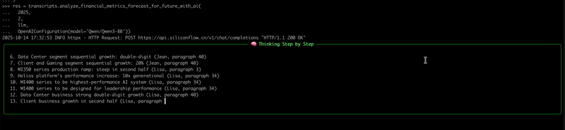

<!-- START doctoc generated TOC please keep comment here to allow auto update -->
<!-- DON'T EDIT THIS SECTION, INSTEAD RE-RUN doctoc TO UPDATE -->
**Table of Contents**  *generated with [DocToc](https://github.com/thlorenz/doctoc)*

- [Example: Using LLMs to Analyze Key Metric Forecasts and Their Drivers in Earnings Call Transcripts](#example-using-llms-to-analyze-key-metric-forecasts-and-their-drivers-in-earnings-call-transcripts)
  - [Prerequisites](#prerequisites)
  - [Example Code](#example-code)
  - [Supported LLM Models](#supported-llm-models)

<!-- END doctoc generated TOC please keep comment here to allow auto update -->


# Example: Using LLMs to Analyze Key Metric Forecasts and Their Drivers in Earnings Call Transcripts
> [!NOTE]
> In earnings calls, management usually shares their outlook on the company's future. These projections are often the focus of analysts’ repeated questions during the Q&A session. Manually reading through lengthy transcripts to extract such outlooks can be very time-consuming.
> 
> This document explains how to use large language models (LLMs) to analyze management’s future outlook. Compared to manual analysis, LLMs can complete the same task in just seconds, providing a clear and traceable reasoning process for review.

## Prerequisites
To run this example, you need: 
1. An OpenAI-compatible API key (`OPEN_AI_API_KEY`)
2. A LLM model with a function call tools capability.
3. A LLM model with a thinking capability.

> [!TIP]
> Our tests were conducted using the [Qwen/Qwen3-Omni-30B-A3B-Thinking](https://huggingface.co/Qwen/Qwen3-Omni-30B-A3B-Thinking) model, achieving over 99% recall and 100% accuracy.
> 
> For optimal results, it is recommended to use large language models with large parameters.

## Example Code
**Below is an example that analyzes key quarterly financial forecast and their causes, using an LLM on earnings call transcripts.**

```python
from openai import OpenAI
from defeatbeta_api.data.ticker import Ticker
from defeatbeta_api.client.openai_conf import OpenAIConfiguration

# Initialize the Ticker
ticker = Ticker("AMD")

# Fetch earnings call transcripts
transcripts = ticker.earning_call_transcripts()

# Configure the OpenAI client
llm = OpenAI(
    api_key="OPEN_AI_API_KEY",  # Replace with your OPEN_AI_API_KEY
    base_url="OPEN_AI_API_END_POINT"  # Replace with your OPEN_AI_API_END_POINT
)

# analyzes key quarterly financial forecast and their causes for Q2 2025 with llm
res = transcripts.analyze_financial_metrics_forecast_for_future_with_ai(
  2025, 
  2, 
  llm, 
  OpenAIConfiguration(model='Qwen/Qwen3-8B'))

print(res.to_string())
```
---

**The following figure illustrates the thought process of the large model:**




---

**The following is the result of the large model’s reasoning:**
```text
╭───────────────────────────────────────────────────────────────────────────────────────────────── 🧠 Finish Think ──────────────────────────────────────────────────────────────────────────────────────────────────╮
│                                                                                                                                                                                                                    │
│                                                                                                                                                                                                                    │
│  Okay, let's tackle this step by step. First, I need to extract the original metrics from the earnings call transcript. The user mentioned that the outlook field should not include any current quarter's actual  │
│  figures, so I have to focus on future projections and guidance.                                                                                                                                                   │
│                                                                                                                                                                                                                    │
│  Starting with the first part, looking through each paragraph. Paragraph 2 mentions the second quarter revenue increased 32% YoY to $7.7 billion, but that's Q2 actuals, so I should skip that. Then in paragraph  │
│  3, there's a mention of "we expect a steep production ramp in the second half of the year to support large-scale production deployments with multiple customers" related to MI350. That's a future projection,    │
│  so that's a metric. Also, "we see a clear path to scaling our AI business to tens of billions of dollars in annual revenue" from paragraph 13. That's a big one.                                                  │
│                                                                                                                                                                                                                    │
│  Looking further, paragraph 18 says "we expect Instinct revenue to grow year-over-year in the third quarter" and "expect a steep production ramp in the second half of the year". So that's another metric. Then   │
│  in paragraph 25, Lisa mentions "we expect the Client and Gaming segment to be down in the fourth quarter" which is a forecast. Also, "we expect third quarter non-GAAP gross margin to be approximately 54%"      │
│  from paragraph 41.                                                                                                                                                                                                │
│                                                                                                                                                                                                                    │
│  Wait, paragraph 41 is Jean's part. Let me check again. In paragraph 41, Jean says "we expect third quarter non-GAAP gross margin to be approximately 54%", which is a future metric. Also, in paragraph 34, Lisa  │
│  talks about the "tens of billions" opportunity for MI400, which is a forecast.                                                                                                                                    │
│                                                                                                                                                                                                                    │
│  Another one in paragraph 35: "we expect significant revenue contribution from Helios in 2026". That's a future metric. Also, in paragraph 39, Jean mentions "we feel really good about the Q2 market share        │
│  increase versus Q1" but that's Q2, so not for original metrics.                                                                                                                                                   │
│                                                                                                                                                                                                                    │
│  Wait, the original metrics need to be future outlooks. So in paragraph 3, the MI350 series ramp in the second half. In paragraph 13, the "tens of billions" for MI400. In paragraph 18, Instinct revenue growth   │
│  in Q3. In paragraph 25, the Client and Gaming segment down in Q4. In paragraph 34, the tens of billions for MI400. In paragraph 35, Helios contributing in 2026. Also, in paragraph 41, the $800 million          │
│  write-down is an actual, so not included.                                                                                                                                                                         │
│                                                                                                                                                                                                                    │
│  Wait, the user said to exclude current quarter's actual figures. So the third quarter guidance is part of the outlook. Let me check paragraph 41 again. Jean says "we expect third quarter non-GAAP gross margin  │
│  to be approximately 54%", which is a forecast. Also, in paragraph 40, Lisa mentions "we are expecting some growth in the Client business, so I wouldn't say it'll be flat to the first half, but it will be --    │
│  we're planning for it to be a little bit less than seasonal just given some of the uncertainties out there." That's a forecast for Client business in Q3.                                                         │
│                                                                                                                                                                                                                    │
│  So compiling all these, the original_metrics would include:                                                                                                                                                       │
│                                                                                                                                                                                                                    │
│  1. MI350 series production ramp in second half (from paragraph 3)                                                                                                                                                 │
│  2. Instinct revenue growth in Q3 (paragraph 18)                                                                                                                                                                   │
│  3. Tens of billions annual revenue for AI business (paragraph 13)                                                                                                                                                 │
│  4. Helios significant revenue contribution in 2026 (paragraph 35)                                                                                                                                                 │
│  5. Third quarter non-GAAP gross margin at 54% (paragraph 41)                                                                                                                                                      │
│  6. Client business growth in Q3 (paragraph 25)                                                                                                                                                                    │
│  7. Data Center segment revenue growth in Q3 (paragraph 40)                                                                                                                                                        │
│  8. Maybe the $800 million write-down is an actual, so not included.                                                                                                                                               │
│                                                                                                                                                                                                                    │
│  Wait, the user said to exclude current quarter's actual figures. The Q3 guidance is part of the outlook. So the third quarter non-GAAP gross margin is a forecast. Also, the Client business growth in Q3 is a    │
│  forecast.                                                                                                                                                                                                         │
│                                                                                                                                                                                                                    │
│  Now, for the processed_metrics, I need to infer attitude and reason for each. For example, the MI350 ramp is optimistic because they mention "steep production ramp" and "large-scale deployments". The reason    │
│  would be the strong customer interest and the transition from MI308 to MI350.                                                                                                                                     │
│                                                                                                                                                                                                                    │
│  The tens of billions in annual revenue for AI is optimistic, driven by the expansion of AI adoption and the MI400 series. The third quarter gross margin at 54% is neutral, as it's a specific number but the     │
│  reason is about operational efficiency and mix.                                                                                                                                                                   │
│                                                                                                                                                                                                                    │
│  The Client business growth in Q3 is optimistic, with reasons about product portfolio and OEM offerings. The Data Center segment growth in Q3 is optimistic due to the ramp of MI350 and the expansion in cloud    │
│  and enterprise.                                                                                                                                                                                                   │
│                                                                                                                                                                                                                    │
│  I need to make sure each processed metric corresponds exactly to the original. Let me list them all and check the numbers and reasons.                                                                            │
│                                                                                                                                                                                                                    │
│                                                                                                                                                                                                                    │
╰────────────────────────────────────────────────────────────────────────────────────────────────────────────────────────────────────────────────────────────────────────────────────────────────────────────────────╯
```

-----

**The following shows the key data forecast and their reasons identified by the large model:**
```text
  symbol  fiscal_year  fiscal_quarter     speaker  paragraph_number               key_financial_metric    attitude                                                 outlook                                                                               reason
0    AMD         2025               2  Jean X. Hu                 4                            Revenue  optimistic  approximately $8.7 billion, plus or minus $300 million                        strong double-digit growth in Data Center and Client segments
1    AMD         2025               2  Jean X. Hu                 4              Non-GAAP gross margin  optimistic                                       approximately 54%                                      ramp of MI350 series and operational efficiency
2    AMD         2025               2  Jean X. Hu                 4        Non-GAAP operating expenses     neutral                             approximately $2.55 billion  investment in go-to-market activities and R&D for future AI expansion opportunities
3    AMD         2025               2  Jean X. Hu                 4    Net interest and other expenses  optimistic                     a gain of approximately $10 million                                     cost management and improved financial structure
4    AMD         2025               2  Jean X. Hu                 4        Non-GAAP effective tax rate     neutral                                                     13%                                                     standard tax rate for the period
5    AMD         2025               2  Jean X. Hu                 4                Diluted share count     neutral                       approximately 1.63 billion shares                             share repurchase program and capital allocation strategy
6    AMD         2025               2  Lisa T. Su                25  Client business sequential growth  optimistic                                single-digit type growth                             strong product mix and expanded breadth of OEM offerings
```
