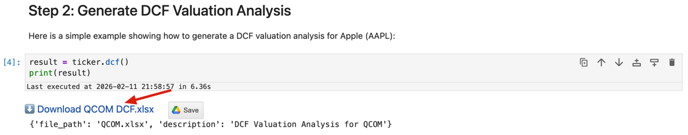
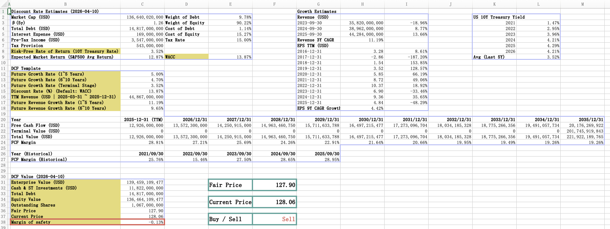

<!-- START doctoc generated TOC please keep comment here to allow auto update -->
<!-- DON'T EDIT THIS SECTION, INSTEAD RE-RUN doctoc TO UPDATE -->
**Table of Contents**  *generated with [DocToc](https://github.com/thlorenz/doctoc)*

- [DCF Valuation Analysis](#dcf-valuation-analysis)
  - [Overview](#overview)
  - [Features](#features)
  - [Usage](#usage)
    - [Basic Usage](#basic-usage)
    - [Output](#output)
    - [File Location](#file-location)
  - [Excel Output Example](#excel-output-example)
    - [Key Sections Explained](#key-sections-explained)
      - [1. Discount Rate Estimates (Top Left)](#1-discount-rate-estimates-top-left)
      - [2. Growth Estimates (Middle Left)](#2-growth-estimates-middle-left)
      - [3. DCF Template (Center)](#3-dcf-template-center)
      - [4. DCF Value (Top Right)](#4-dcf-value-top-right)
      - [5. Investment Decision (Right)](#5-investment-decision-right)
  - [Customization in Excel](#customization-in-excel)
  - [Use Cases](#use-cases)
    - [Investment Analysis](#investment-analysis)
    - [Portfolio Management](#portfolio-management)
    - [Due Diligence](#due-diligence)
    - [Sensitivity Analysis](#sensitivity-analysis)
    - [Educational Purposes](#educational-purposes)
  - [Best Practices](#best-practices)
  - [Technical Details](#technical-details)
    - [Data Sources](#data-sources)
    - [Calculations](#calculations)
    - [Currency](#currency)
  - [Limitations](#limitations)
  - [Related Methods](#related-methods)
  - [Example Workflow](#example-workflow)
  - [FAQ](#faq)

<!-- END doctoc generated TOC please keep comment here to allow auto update -->

# DCF Valuation Analysis

The `dcf()` method generates a comprehensive Discounted Cash Flow (DCF) valuation Excel spreadsheet for detailed stock valuation analysis. This tool automates the complex DCF calculation process and presents results in a professional, easy-to-understand format.

## Overview

The DCF method is one of the most important valuation techniques in finance. It estimates a company's intrinsic value by projecting future free cash flows and discounting them back to present value using the Weighted Average Cost of Capital (WACC).

## Features

The generated Excel workbook includes five main sections:

1. **📊 Discount Rate Estimates**
   - Cost of Equity calculation
   - Cost of Debt calculation
   - WACC (Weighted Average Cost of Capital) calculation
   - Beta and risk-free rate metrics

2. **📈 Growth Estimates**
   - Historical 3-year CAGR for Revenue
   - Historical 3-year CAGR for Free Cash Flow (FCF)
   - Historical 3-year CAGR for EBITDA
   - Historical 3-year CAGR for Net Income
   - Year-over-year growth details for the past 3 years

3. **🧮 DCF Template**
   - 10-year cash flow projections
   - Discount factors for each year
   - Present value calculations
   - Terminal value estimation
   - Total enterprise value calculation

4. **💰 DCF Value**
   - Enterprise Value (EV)
   - Cash and cash equivalents
   - Total debt
   - Equity Value calculation
   - Shares outstanding
   - Fair price per share
   - Current market price
   - Margin of safety

5. **✅ Investment Recommendation**
   - Buy/Sell recommendation based on fair value vs. current price
   - Quick decision support for investors

## Usage

### Basic Usage

```python
from defeatbeta_api import Ticker

# Initialize ticker
ticker = Ticker("QCOM")

# Generate DCF analysis
result = ticker.dcf()

print(result)
```

### Output

```python
>>> ticker.dcf()
{
    'file_path': '/path/to/QCOM.xlsx',
    'description': 'DCF Valuation Analysis for QCOM'
}
```

The method returns a dictionary containing:
- `file_path`: The absolute path to the generated Excel file
- `description`: A brief description of the analysis

### File Location

- **[In Jupyter Notebook](https://mybinder.org/v2/gh/defeat-beta/defeatbeta-api/main?urlpath=lab/tree/notebooks/06_tutorial_dcf.ipynb)**: The Excel file is saved to your current working directory (e.g., `QCOM.xlsx`)
- **In Python Script**: The Excel file is saved to the DCF directory (e.g., `/tmp/defeatbeta/dcf/QCOM.xlsx`)

In Jupyter notebooks, the method also displays an interactive download button for easy access to the file.


## Excel Output Example

Below is a complete DCF analysis for QCOM (Qualcomm):



### Key Sections Explained

#### 1. Discount Rate Estimates (Top Left)
This section calculates the WACC, which is used to discount future cash flows. It includes:
- **Cost of Equity**: Calculated using the Capital Asset Pricing Model (CAPM)
- **Cost of Debt**: Based on the company's borrowing rate
- **WACC**: Weighted average of equity and debt costs

#### 2. Growth Estimates (Middle Left)
Historical growth rates help project future performance:
- **Revenue CAGR**: Compound annual growth rate of revenue
- **FCF CAGR**: Free cash flow growth rate
- **EBITDA CAGR**: Earnings before interest, taxes, depreciation, and amortization growth
- **Net Income CAGR**: Net profit growth rate

Each metric shows the past 3 years of data with year-over-year growth percentages.

#### 3. DCF Template (Center)
The core DCF calculation with 10-year projections:
- **Year 0 (Base)**: Starting with the most recent TTM Free Cash Flow
- **Years 1-10**: Projected cash flows based on selected growth rate
- **Discount Factor**: Present value factor for each year
- **Present Value**: Discounted cash flow for each year
- **Terminal Value**: Value beyond the 10-year projection period
- **Total PV**: Sum of all present values

#### 4. DCF Value (Top Right)
Final valuation results:
- **Enterprise Value (EV)**: Total value of the operating business
- **+ Cash**: Add cash and cash equivalents
- **- Debt**: Subtract total debt
- **= Equity Value**: Value attributable to shareholders
- **÷ Shares Outstanding**: Number of shares
- **= Fair Price**: Estimated fair value per share

#### 5. Investment Decision (Right)
- **Fair Price**: DCF-calculated fair value
- **Current Price**: Current market price
- **Buy/Sell**: Recommendation based on the comparison
  - **Buy**: When fair price > current price (undervalued)
  - **Sell**: When fair price < current price (overvalued)

## Customization in Excel

The generated Excel file is fully editable, allowing you to:

1. **Adjust Growth Assumptions**: Modify the growth rate used in projections
2. **Change Discount Rate**: Update WACC if you disagree with the calculated rate
3. **Modify Terminal Growth**: Adjust the perpetual growth rate
4. **Update Forecasts**: Edit year-by-year projections manually
5. **Recalculate**: All formulas are live and will automatically update

## Use Cases

### Investment Analysis
Determine if a stock is undervalued or overvalued based on fundamental cash flow analysis.

### Portfolio Management
Compare DCF valuations across multiple stocks to identify the best opportunities.

### Due Diligence
Perform detailed valuation analysis for M&A transactions or investment decisions.

### Sensitivity Analysis
Modify assumptions in the Excel file to see how different scenarios affect fair value.

### Educational Purposes
Learn DCF methodology by examining a real-world, automated DCF model.

## Best Practices

1. **Understand the Assumptions**: Review the growth rates and discount rate before making decisions
2. **Consider Multiple Scenarios**: Run DCF for different growth assumptions
3. **Compare with Other Metrics**: Use DCF alongside P/E, P/B, and other valuation methods
4. **Update Regularly**: Regenerate DCF analysis after earnings releases or major events
5. **Industry Context**: Consider industry-specific factors that may affect growth rates

## Technical Details

### Data Sources
- **Financial Statements**: Latest annual and quarterly reports
- **Market Data**: Current stock price, shares outstanding
- **Risk Metrics**: Beta, risk-free rate, market risk premium
- **Growth Metrics**: Historical revenue, FCF, EBITDA, and net income

### Calculations
- **WACC**: `(E/V × Cost of Equity) + (D/V × Cost of Debt × (1 - Tax Rate))`
- **CAGR**: `((Ending Value / Beginning Value)^(1/Years)) - 1`
- **Present Value**: `Future Cash Flow / (1 + Discount Rate)^Year`
- **Terminal Value**: `Final Year FCF × (1 + Terminal Growth) / (WACC - Terminal Growth)`

### Currency
The DCF analysis automatically uses the company's financial reporting currency (e.g., USD, CNY, EUR).

## Limitations

While DCF is a powerful valuation tool, keep in mind:

1. **Garbage In, Garbage Out**: The quality of DCF depends on the quality of assumptions
2. **Future Uncertainty**: Long-term projections are inherently uncertain
3. **Growth Rate Sensitivity**: Small changes in growth assumptions can significantly affect fair value
4. **Not Suitable for All Companies**: DCF works best for companies with stable, predictable cash flows
5. **Qualitative Factors**: DCF doesn't capture competitive advantages, management quality, or industry disruption

## Related Methods

Complement your DCF analysis with these other valuation metrics:

- [`ticker.ttm_pe()`](Value_Examples.md#2-stock-ttm-pe) - Price-to-Earnings ratio
- [`ticker.historical_pb_ratio()`](Value_Examples.md#5-stock-historical-pb-ratio) - Price-to-Book ratio
- [`ticker.historical_ps_ratio()`](Value_Examples.md#4-stock-historical-ps-ratio) - Price-to-Sales ratio
- [`ticker.historical_peg_ratio()`](Value_Examples.md#6-stock-historical-peg-ratio) - PEG ratio
- [`ticker.wacc()`](Value_Examples.md#12-stock-historical-wacc) - Weighted Average Cost of Capital
- [`ticker.annual_fcf_yoy_growth()`](Growth_Examples.md#10-stock-annual-free-cash-flow-yoy-growth) - Free Cash Flow growth

## Example Workflow

```python
from defeatbeta_api import Ticker

# Initialize ticker
ticker = Ticker("AAPL")

# Step 1: Generate DCF analysis
dcf_result = ticker.dcf()
print(f"DCF file saved to: {dcf_result['file_path']}")

# Step 2: Review supporting metrics
wacc = ticker.wacc()
fcf_growth = ticker.annual_fcf_yoy_growth()
revenue_growth = ticker.annual_revenue_yoy_growth()

# Step 3: Open the Excel file and review assumptions
# Step 4: Adjust assumptions if needed
# Step 5: Make investment decision based on fair value vs. current price
```

## FAQ

**Q: How often should I regenerate the DCF analysis?**
A: Regenerate after earnings releases, major company announcements, or significant market changes (quarterly is typical).

**Q: Can I trust the Buy/Sell recommendation?**
A: The recommendation is based on DCF fair value vs. current price, but you should always do additional research and consider other factors.

**Q: What if the growth rate seems too high or too low?**
A: You can manually edit the growth assumptions in the Excel file. The CAGR is calculated from historical data, but future growth may differ.

**Q: Does this work for all companies?**
A: DCF works best for established companies with predictable cash flows. It's less reliable for startups, high-growth tech companies, or companies with volatile earnings.

**Q: Can I use this for non-US stocks?**
A: Yes, the method automatically handles different currencies and works for any ticker supported by the API.

---

**💡 Tip**: Combine DCF analysis with qualitative research, industry analysis, and competitive positioning for a complete investment thesis.
