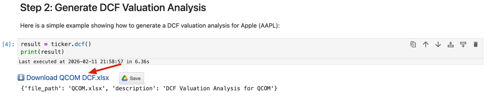
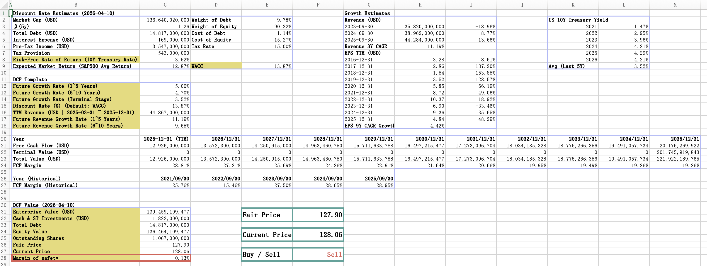

<!-- START doctoc generated TOC please keep comment here to allow auto update -->
<!-- DON'T EDIT THIS SECTION, INSTEAD RE-RUN doctoc TO UPDATE -->
**Table of Contents**  *generated with [DocToc](https://github.com/thlorenz/doctoc)*

- [DCF Valuation Analysis](#dcf-valuation-analysis)
  - [Overview](#overview)
  - [Features](#features)
  - [Usage](#usage)
    - [Basic Usage](#basic-usage)
    - [Output](#output)
    - [File Location](#file-location)
  - [Programmatic Access: `dcf_data()`](#programmatic-access-dcf_data)
    - [Basic Usage](#basic-usage-1)
    - [Return Structure](#return-structure)
    - [Use Cases](#use-cases)
      - [Batch Screening](#batch-screening)
      - [Custom Visualization](#custom-visualization)
      - [Sensitivity Analysis](#sensitivity-analysis)
    - [`dcf()` vs `dcf_data()`](#dcf-vs-dcf_data)
  - [Excel Output Example](#excel-output-example)
    - [Key Sections Explained](#key-sections-explained)
      - [1. Discount Rate Estimates (Top Left, B1:E9)](#1-discount-rate-estimates-top-left-b1e9)
      - [2. Growth Estimates (Middle Left, G1:H)](#2-growth-estimates-middle-left-g1h)
      - [3. US 10Y Treasury Yield (K2:L)](#3-us-10y-treasury-yield-k2l)
      - [4. DCF Template (Center, B11:M)](#4-dcf-template-center-b11m)
      - [5. DCF Value (Bottom Left, B30:C38)](#5-dcf-value-bottom-left-b30c38)
      - [6. Investment Recommendation (E31:F38)](#6-investment-recommendation-e31f38)
  - [Customization in Excel](#customization-in-excel)
  - [Use Cases](#use-cases-1)
    - [Investment Analysis](#investment-analysis)
    - [Portfolio Management](#portfolio-management)
    - [Due Diligence](#due-diligence)
    - [Sensitivity Analysis](#sensitivity-analysis-1)
    - [Educational Purposes](#educational-purposes)
  - [Best Practices](#best-practices)
  - [Technical Details](#technical-details)
    - [Data Sources](#data-sources)
    - [Calculations](#calculations)
    - [Currency](#currency)
  - [Limitations](#limitations)
  - [Related Methods](#related-methods)
  - [Example Workflow](#example-workflow)
  - [FAQ](#faq)

<!-- END doctoc generated TOC please keep comment here to allow auto update -->

# DCF Valuation Analysis

The `dcf()` method generates a comprehensive Discounted Cash Flow (DCF) valuation Excel spreadsheet for detailed stock valuation analysis. This tool automates the complex DCF calculation process and presents results in a professional, easy-to-understand format.

## Overview

The DCF method is one of the most important valuation techniques in finance. It estimates a company's intrinsic value by projecting future free cash flows and discounting them back to present value using the Weighted Average Cost of Capital (WACC).

## Features

The generated Excel workbook includes five main sections:

1. **📊 Discount Rate Estimates (B1:E9)**
   - Market Cap, Beta (5Y), Total Debt, Interest Expense, Pre-Tax Income, Tax Provision
   - Risk-Free Rate of Return (5Y average of US 10Y Treasury Yield)
   - Expected Market Return (S&P 500 10Y CAGR)
   - Weight of Debt / Equity, Cost of Debt / Equity, Tax Rate
   - WACC (Weighted Average Cost of Capital)

2. **📈 Growth Estimates (G1:H)**
   - Historical 3-year Revenue with YoY growth and 3Y CAGR
   - Historical EPS (TTM) with YoY growth and dynamic EPS CAGR (up to 10 years)

3. **📊 US 10Y Treasury Yield (K2:L)**
   - Annual average yields for the last 5 years
   - 5-year average (used as terminal growth rate and risk-free rate)

4. **🧮 DCF Template (B11:M)**
   - 3-stage growth model: Near-term (1-5Y), Mid-term (6-10Y linear interpolation), Terminal
   - Growth rates capped at 5%-20% for near-term
   - TTM Revenue and Revenue growth rates
   - 10-year FCF projections with Terminal Value (Gordon Growth Model)
   - Total Value and FCF Margin for each year
   - Historical FCF Margin for reference

5. **💰 DCF Value (B30:C38)**
   - Enterprise Value (NPV of projected total values)
   - Cash & Short-Term Investments
   - Total Debt
   - Equity Value (EV + Cash - Debt)
   - Outstanding Shares
   - Fair Price per share
   - Current market price
   - Margin of safety

6. **✅ Investment Recommendation (E31:F38)**
   - Fair Price, Current Price, and Buy/Sell recommendation
   - Color-coded: green for Buy, red for Sell

## Usage

### Basic Usage

```python
from defeatbeta_api import Ticker

# Initialize ticker
ticker = Ticker("QCOM")

# Generate DCF analysis
result = ticker.dcf()

print(result)
```

### Output

```python
>>> ticker.dcf()
{
    'file_path': '/path/to/QCOM.xlsx',
    'description': 'DCF Valuation Analysis for QCOM'
}
```

The method returns a dictionary containing:
- `file_path`: The absolute path to the generated Excel file
- `description`: A brief description of the analysis

### File Location

- **[In Jupyter Notebook](https://mybinder.org/v2/gh/defeat-beta/defeatbeta-api/main?urlpath=lab/tree/notebooks/06_tutorial_dcf.ipynb)**: The Excel file is saved to your current working directory (e.g., `QCOM.xlsx`)
- **In Python Script**: The Excel file is saved to the DCF directory (e.g., `/tmp/defeatbeta/dcf/QCOM.xlsx`)

In Jupyter notebooks, the method also displays an interactive download button for easy access to the file.


## Programmatic Access: `dcf_data()`

The `dcf_data()` method returns the same DCF valuation as `dcf()`, but as a structured Python dictionary instead of an Excel file. This is useful for programmatic access, automated pipelines, and custom analysis.

### Basic Usage

```python
from defeatbeta_api import Ticker

ticker = Ticker("QCOM")
data = ticker.dcf_data()
```

### Return Structure

```python
{
    "symbol": "QCOM",
    "discount_rate": {
        "report_date": "2026-01-31",
        "market_cap": 189000000000,
        "beta_5y": 1.23,
        "total_debt": 15800000000,
        "interest_expense": 680000000,
        "pretax_income": 11200000000,
        "tax_provision": 1200000000,
        "risk_free_rate": 0.0352,        # 5Y avg of 10Y Treasury
        "expected_market_return": 0.1287, # S&P 500 10Y CAGR
        "weight_of_debt": 0.0771,
        "weight_of_equity": 0.9229,
        "cost_of_debt": 0.043,
        "cost_of_equity": 0.152,
        "tax_rate": 0.107,
        "wacc": 0.1434,
    },
    "growth_estimates": {
        "currency": "USD",
        "revenue": {
            "details": [
                {"date": "2023-12-31", "value": 35820000000, "yoy": -0.039},
                ...
            ],
            "cagr_3y": 0.2358,
        },
        "eps": {
            "details": [
                {"date": "2016-12-31", "value": -0.61, "yoy": 0.2738},
                ...
            ],
            "cagr_10y": 0.3518,
            "cagr_years": 7,
        },
        "treasury": {
            "details": [
                {"year": 2021, "avg_yield": 0.0147},
                ...
            ],
            "avg_5y": 0.0352,
        },
    },
    "dcf_template": {
        "growth_rate_1_5y": 0.20,         # EPS CAGR capped at 5%-20%
        "growth_rate_6_10y": 0.167,        # Year-6 linear interpolation
        "growth_rate_terminal": 0.0352,    # 5Y avg Treasury
        "discount_rate": 0.1434,           # = WACC
        "ttm_revenue": 34639000000,
        "ttm_revenue_label": "TTM Revenue (USD | 2025-03-31 ~ 2025-12-31)",
        "ttm_period": "2025-03-31 ~ 2025-12-31",
        "base_fcf": 6735000000,
        "end_date": "2025-12-31",
        "revenue_growth_1_5y": 0.20,
        "revenue_growth_6_10y": 0.167,
        "projections": [
            {"year": 0, "date": "2025-12-31", "fcf": 6735000000, "terminal_value": 0, "total_value": 6735000000, "fcf_margin": 0.1944},
            {"year": 1, "date": "2026/12/31", "fcf": 8082000000, "terminal_value": 0, "total_value": 8082000000, "fcf_margin": 0.1944},
            ...
        ],
        "historical_fcf_margin": [
            {"date": "2021/12/31", "margin": 0.1959},
            ...
        ],
    },
    "dcf_value": {
        "report_date": "2026-04-10",
        "enterprise_value": 76174665515,
        "cash": 10552000000,
        "total_debt": 3847000000,
        "equity_value": 82879665515,
        "shares_outstanding": 1630338800,
        "fair_price": 50.84,
        "current_price": 245.04,
        "margin_of_safety": -3.8202,
        "recommendation": "Sell",
    },
}
```

> **Note**: The values above are illustrative. Actual values will vary based on the latest market data.

### Use Cases

#### Batch Screening
```python
tickers = ["AAPL", "MSFT", "GOOGL", "AMZN", "META"]
for symbol in tickers:
    data = Ticker(symbol).dcf_data()
    dv = data["dcf_value"]
    print(f"{symbol}: Fair=${dv['fair_price']:.2f}, Current=${dv['current_price']:.2f}, {dv['recommendation']}")
```

#### Custom Visualization
```python
import matplotlib.pyplot as plt

data = Ticker("QCOM").dcf_data()
proj = data["dcf_template"]["projections"]
years = [p["year"] for p in proj]
fcf = [p["fcf"] / 1e9 for p in proj]

plt.bar(years, fcf)
plt.xlabel("Year")
plt.ylabel("FCF (Billions USD)")
plt.title("QCOM 10-Year FCF Projection")
plt.show()
```

#### Sensitivity Analysis
```python
# Compare fair prices across different WACC assumptions
data = Ticker("QCOM").dcf_data()
base_wacc = data["discount_rate"]["wacc"]
print(f"Base WACC: {base_wacc:.2%}, Fair Price: ${data['dcf_value']['fair_price']:.2f}")
```

### `dcf()` vs `dcf_data()`

| | `dcf()` | `dcf_data()` |
|---|---|---|
| **Returns** | Excel file path | Python dictionary |
| **Best for** | Manual review, presentations | Automation, pipelines, custom analysis |
| **Formulas** | Live Excel formulas (editable) | Pre-computed values |
| **Visualization** | Built-in Excel formatting | Build your own |

## Excel Output Example

Below is a complete DCF analysis for QCOM (Qualcomm):



### Key Sections Explained

#### 1. Discount Rate Estimates (Top Left, B1:E9)
This section calculates the WACC, which is used to discount future cash flows:
- **Risk-Free Rate**: 5-year average of US 10Y Treasury Yield (linked from the Treasury section)
- **Expected Market Return**: S&P 500 10-year CAGR
- **Cost of Equity**: Calculated using CAPM: `Rf + β × (Rm - Rf)`
- **Cost of Debt**: Interest Expense / Total Debt
- **WACC**: `Wd × Kd × (1 - Tax Rate) + We × Ke`

#### 2. Growth Estimates (Middle Left, G1:H)
Historical growth rates help project future performance:
- **Revenue (3Y)**: Last 3 years of annual revenue with YoY growth and 3Y CAGR
- **EPS TTM (up to 10Y)**: Historical TTM EPS snapshots with YoY growth and dynamic CAGR

The EPS CAGR is calculated using an Excel formula that dynamically finds the first year with positive EPS as the starting point.

#### 3. US 10Y Treasury Yield (K2:L)
Reference data for risk-free rate and terminal growth rate:
- **Annual Averages**: Average 10Y Treasury yield for each of the last 5 years
- **5Y Average**: Used as both the risk-free rate (C8) and terminal growth rate (C14)

#### 4. DCF Template (Center, B11:M)
The core DCF calculation using a **3-stage growth model** with 10-year projections:
- **Future Growth Rate (1-5Y)**: EPS CAGR capped between 5% and 20%
- **Future Growth Rate (6-10Y)**: Linear interpolation from near-term rate to terminal rate
- **Future Growth Rate (Terminal)**: 5Y average of 10Y Treasury Yield
- **Discount Rate**: Defaults to WACC
- **Free Cash Flow**: 10-year projections based on growth rates
- **Terminal Value**: Gordon Growth Model: `FCF₁₀ × (1 + g) / (WACC - g)`
- **Total Value**: FCF + Terminal Value (year 10 only)
- **FCF Margin**: FCF / projected revenue for each year
- **Historical FCF Margin**: Last 5 years for reference

#### 5. DCF Value (Bottom Left, B30:C38)
Final valuation results:
- **Enterprise Value**: NPV of 10-year projected total values, discounted at WACC
- **+ Cash & ST Investments**: From the latest balance sheet (converted to USD)
- **- Total Debt**: From discount rate section
- **= Equity Value**: Enterprise Value + Cash - Debt
- **÷ Outstanding Shares**: Current shares outstanding
- **= Fair Price**: Estimated fair value per share
- **Margin of Safety**: (Fair Price - Current Price) / Fair Price

#### 6. Investment Recommendation (E31:F38)
- **Fair Price**: DCF-calculated fair value (large display)
- **Current Price**: Current market price (large display)
- **Buy/Sell**: Color-coded recommendation
  - **Buy** (green): When fair price > current price (undervalued)
  - **Sell** (red): When fair price < current price (overvalued)

## Customization in Excel

The generated Excel file is fully editable, allowing you to:

1. **Adjust Growth Rates**: Modify Future Growth Rate (1-5Y) in C12 to change near-term FCF projections
2. **Change Discount Rate**: Override WACC in C15 if you disagree with the calculated rate
3. **Modify Terminal Growth**: Adjust the terminal stage rate in C14
4. **Change Revenue Growth**: Modify Future Revenue Growth Rate (1-5Y) in C17 to adjust FCF margin projections
5. **Recalculate**: All formulas are live — cells highlighted in orange are editable inputs that automatically update downstream calculations

## Use Cases

### Investment Analysis
Determine if a stock is undervalued or overvalued based on fundamental cash flow analysis.

### Portfolio Management
Compare DCF valuations across multiple stocks to identify the best opportunities.

### Due Diligence
Perform detailed valuation analysis for M&A transactions or investment decisions.

### Sensitivity Analysis
Modify assumptions in the Excel file to see how different scenarios affect fair value.

### Educational Purposes
Learn DCF methodology by examining a real-world, automated DCF model.

## Best Practices

1. **Understand the Assumptions**: Review the growth rates and discount rate before making decisions
2. **Consider Multiple Scenarios**: Run DCF for different growth assumptions
3. **Compare with Other Metrics**: Use DCF alongside P/E, P/B, and other valuation methods
4. **Update Regularly**: Regenerate DCF analysis after earnings releases or major events
5. **Industry Context**: Consider industry-specific factors that may affect growth rates

## Technical Details

### Data Sources
- **Financial Statements**: Latest annual and quarterly reports (revenue, EPS, FCF, balance sheet)
- **Market Data**: Current stock price, shares outstanding, market capitalization
- **Risk Metrics**: Beta (5Y), US 10Y Treasury Yield (5Y history), S&P 500 10Y CAGR
- **Growth Metrics**: Historical revenue (3Y), EPS TTM (up to 10Y), FCF margin (5Y)

### Calculations
- **CAPM**: `Cost of Equity = Rf + β × (Rm - Rf)`
- **WACC**: `Wd × Kd × (1 - Tax Rate) + We × Ke`
- **CAGR**: `(Ending Value / Beginning Value)^(1/Years) - 1`
- **Enterprise Value (NPV)**: `Σ Total Value_i / (1 + WACC)^i` for i = 1 to 10
- **Terminal Value**: `FCF₁₀ × (1 + g_terminal) / (WACC - g_terminal)` (Gordon Growth Model)
- **Equity Value**: `Enterprise Value + Cash - Total Debt`
- **Fair Price**: `Equity Value / Shares Outstanding`

### Currency
The DCF analysis automatically uses the company's financial reporting currency (e.g., USD, CNY, EUR).

## Limitations

While DCF is a powerful valuation tool, keep in mind:

1. **Garbage In, Garbage Out**: The quality of DCF depends on the quality of assumptions
2. **Future Uncertainty**: Long-term projections are inherently uncertain
3. **Growth Rate Sensitivity**: Small changes in growth assumptions can significantly affect fair value
4. **Not Suitable for All Companies**: DCF works best for companies with stable, predictable cash flows
5. **Qualitative Factors**: DCF doesn't capture competitive advantages, management quality, or industry disruption

## Related Methods

Complement your DCF analysis with these other valuation metrics:

- [`ticker.ttm_pe()`](Value_Examples.md#2-stock-ttm-pe) - Price-to-Earnings ratio
- [`ticker.historical_pb_ratio()`](Value_Examples.md#5-stock-historical-pb-ratio) - Price-to-Book ratio
- [`ticker.historical_ps_ratio()`](Value_Examples.md#4-stock-historical-ps-ratio) - Price-to-Sales ratio
- [`ticker.historical_peg_ratio()`](Value_Examples.md#6-stock-historical-peg-ratio) - PEG ratio
- [`ticker.wacc()`](Value_Examples.md#12-stock-historical-wacc) - Weighted Average Cost of Capital
- [`ticker.annual_fcf_yoy_growth()`](Growth_Examples.md#10-stock-annual-free-cash-flow-yoy-growth) - Free Cash Flow growth

## Example Workflow

```python
from defeatbeta_api import Ticker

# Initialize ticker
ticker = Ticker("AAPL")

# Step 1: Generate DCF analysis
dcf_result = ticker.dcf()
print(f"DCF file saved to: {dcf_result['file_path']}")

# Step 2: Review supporting metrics
wacc = ticker.wacc()
fcf_growth = ticker.annual_fcf_yoy_growth()
revenue_growth = ticker.annual_revenue_yoy_growth()

# Step 3: Open the Excel file and review assumptions
# Step 4: Adjust assumptions if needed
# Step 5: Make investment decision based on fair value vs. current price
```

## FAQ

**Q: How often should I regenerate the DCF analysis?**
A: Regenerate after earnings releases, major company announcements, or significant market changes (quarterly is typical).

**Q: Can I trust the Buy/Sell recommendation?**
A: The recommendation is based on DCF fair value vs. current price, but you should always do additional research and consider other factors.

**Q: What if the growth rate seems too high or too low?**
A: You can manually edit the growth assumptions in the Excel file. Near-term growth (C12) is auto-capped between 5% and 20%, but you can override it. All orange-highlighted cells are editable inputs.

**Q: Does this work for all companies?**
A: DCF works best for established companies with predictable cash flows. It's less reliable for startups, high-growth tech companies, or companies with volatile earnings.

**Q: Can I use this for non-US stocks?**
A: Yes, the method automatically handles different currencies and works for any ticker supported by the API.

---

**💡 Tip**: Combine DCF analysis with qualitative research, industry analysis, and competitive positioning for a complete investment thesis.
