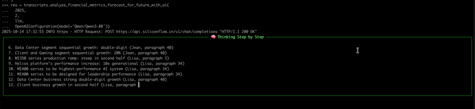

<!-- START doctoc generated TOC please keep comment here to allow auto update -->
<!-- DON'T EDIT THIS SECTION, INSTEAD RE-RUN doctoc TO UPDATE -->
**Table of Contents**  *generated with [DocToc](https://github.com/thlorenz/doctoc)*

- [Example: Using LLMs to Analyze Key Metric Forecasts and Their Drivers in Earnings Call Transcripts](#example-using-llms-to-analyze-key-metric-forecasts-and-their-drivers-in-earnings-call-transcripts)
  - [Prerequisites](#prerequisites)
  - [Example](#example)
    - [Code](#code)
    - [The Large Model’s Thought Process](#the-large-models-thought-process)
    - [The Large Model’s Reasoning](#the-large-models-reasoning)
    - [Output Result](#output-result)

<!-- END doctoc generated TOC please keep comment here to allow auto update -->


# Example: Using LLMs to Analyze Key Metric Forecasts and Their Drivers in Earnings Call Transcripts
> [!NOTE]
> In earnings calls, management usually shares their outlook on the company's future. These projections are often the focus of analysts’ repeated questions during the Q&A session. Manually reading through lengthy transcripts to extract such outlooks can be very time-consuming.
> 
> This document explains how to use large language models (LLMs) to analyze management’s future outlook. Compared to manual analysis, LLMs can complete the same task in just seconds, providing a clear and traceable reasoning process for review.

## Prerequisites
To run this example, you need: 
1. An OpenAI-compatible API key (`OPEN_AI_API_KEY`)
2. A LLM model with a function call tools capability.
3. A LLM model with a thinking capability.

> [!TIP]
> Our tests were conducted using the [Qwen/Qwen3-Omni-30B-A3B-Thinking](https://huggingface.co/Qwen/Qwen3-Omni-30B-A3B-Thinking) model, achieving over 99% recall and 100% accuracy.
> 
> For optimal results, it is recommended to use large language models with large parameters.

## Example
### Code

```python
from openai import OpenAI
from defeatbeta_api.data.ticker import Ticker
from defeatbeta_api.client.openai_conf import OpenAIConfiguration

# Initialize the Ticker
ticker = Ticker("AMD")

# Fetch earnings call transcripts
transcripts = ticker.earning_call_transcripts()

# Configure the OpenAI client
llm = OpenAI(
    api_key="OPEN_AI_API_KEY",  # Replace with your OPEN_AI_API_KEY
    base_url="OPEN_AI_API_END_POINT"  # Replace with your OPEN_AI_API_END_POINT
)

# analyzes key quarterly financial forecast and their causes for Q2 2025 with llm
res = transcripts.analyze_financial_metrics_forecast_for_future_with_ai(
  2025, 
  2, 
  llm, 
  OpenAIConfiguration(model='Qwen/Qwen3-Omni-30B-A3B-Thinking'))

print(res.to_string())
```
---

### The Large Model’s Thought Process




---

### The Large Model’s Reasoning
```text
╭───────────────────────────────────────────────────────────────────────────────────────────────── 🧠 Finish Think ──────────────────────────────────────────────────────────────────────────────────────────────────╮
│                                                                                                                                                                                                                    │
│                                                                                                                                                                                                                    │
│  Okay, let's tackle this problem. The user wants me to analyze every sentence in the provided earnings call transcripts and extract key sentences that include projections of the future with specific numerical   │
│  figures. The function to use is extract_sentences, which requires identifying sentences with explicit numerical projections like percentages, basis points, or monetary amounts related to future guidance.       │
│                                                                                                                                                                                                                    │
│  First, I need to go through each paragraph and check the sentences for any mention of future projections with numbers. Let me start by scanning through the transcript.                                           │
│                                                                                                                                                                                                                    │
│  Looking at paragraph 4, Jean Hu's part: "For the third quarter of 2025, we expect revenue to be approximately $8.7 billion, plus or minus $300 million." That's a clear projection with a monetary amount. Also,  │
│  "The midpoint of our guidance represents approximately 28% year-over-year revenue growth..." So that's a percentage. Then "We expect third quarter non-GAAP gross margin to be approximately 54%..." Another      │
│  percentage. Also, "non-GAAP operating expenses to be approximately $2.55 billion." So these are all numerical figures for future expectations.                                                                    │
│                                                                                                                                                                                                                    │
│  Next, in paragraph 13, Lisa Su talks about sovereign opportunities but doesn't give specific numbers. Paragraph 18 mentions MI355 ramping, but the exact numbers might be in Jean's guidance. Wait, Jean's        │
│  guidance in paragraph 4 has the numbers. Let me check again.                                                                                                                                                      │
│                                                                                                                                                                                                                    │
│  In paragraph 4, Jean says: "For the third quarter of 2025, we expect revenue to be approximately $8.7 billion, plus or minus $300 million." So that's a key sentence. Also, "The midpoint of our guidance         │
│  represents approximately 28% year-over-year revenue growth..." and "We expect third quarter non-GAAP gross margin to be approximately 54%..." and "non-GAAP operating expenses to be approximately $2.55          │
│  billion."                                                                                                                                                                                                         │
│                                                                                                                                                                                                                    │
│  Another part: "We expect net interest and other expenses to be a gain of approximately $10 million." So that's another number. Also, "non-GAAP effective tax rate to be 13%..." and "diluted share count is       │
│  expected to be approximately 1.63 billion shares."                                                                                                                                                                │
│                                                                                                                                                                                                                    │
│  Wait, the user wants sentences that include projections of future with specific numerical figures. So all these numbers in Jean's guidance for Q3 2025 are key. Let me check if there are other sentences.        │
│                                                                                                                                                                                                                    │
│  In paragraph 23, Lisa Su says: "I think the adoption is a bit faster than we might have expected." But that's not numerical. Paragraph 25: "We do expect the -- some growth -- sequential growth in clients as    │
│  we go into the third quarter, I would say sort of single-digit type growth." But "single-digit" is vague, not a specific number. So maybe not.                                                                    │
│                                                                                                                                                                                                                    │
│  Looking at paragraph 34, Lisa Su mentions "tens of billions of dollars" but that's a general term, not a specific number. Paragraph 36: "We're seeing the importance of the scale-up and scale-out                │
│  architecture..." but no numbers.                                                                                                                                                                                  │
│                                                                                                                                                                                                                    │
│  In paragraph 45, Lisa Su says: "We would expect significant revenue contribution from Helios in 2026." But "significant" is not numerical. However, in paragraph 4, Jean's guidance has specific numbers for Q3   │
│  2025. Also, in paragraph 4, Jean mentions "We expect third quarter non-GAAP gross margin to be approximately 54%..." which is a specific number.                                                                  │
│                                                                                                                                                                                                                    │
│  Another possible sentence: "We expect Instinct revenue to grow year-over-year in the third quarter, driven by the ramp of MI350 at multiple customers." But here, "grow year-over-year" is a general statement    │
│  without a specific number. However, Jean's guidance gives the exact numbers for revenue, gross margin, etc.                                                                                                       │
│                                                                                                                                                                                                                    │
│  So the key sentences are in Jean Hu's part (paragraph 4) where he provides specific numerical projections for Q3 2025. Let me check the exact sentences:                                                          │
│                                                                                                                                                                                                                    │
│  - "For the third quarter of 2025, we expect revenue to be approximately $8.7 billion, plus or minus $300 million."                                                                                                │
│  - "The midpoint of our guidance represents approximately 28% year-over-year revenue growth..."                                                                                                                    │
│  - "We expect third quarter non-GAAP gross margin to be approximately 54%, and we expect non-GAAP operating expenses to be approximately $2.55 billion."                                                           │
│  - "We expect net interest and other expenses to be a gain of approximately $10 million."                                                                                                                          │
│  - "We expect our non-GAAP effective tax rate to be 13%, and diluted share count is expected to be approximately 1.63 billion shares."                                                                             │
│                                                                                                                                                                                                                    │
│  These all have specific numbers. Also, in paragraph 4, Jean mentions "We expect third quarter non-GAAP gross margin to be approximately 54%..." which is a key projection.                                        │
│                                                                                                                                                                                                                    │
│  Another possible sentence: "We expect Instinct revenue to grow year-over-year in the third quarter, driven by the ramp of MI350 at multiple customers." But here, "grow year-over-year" is a general statement    │
│  without a specific number. However, Jean's guidance provides the exact numbers, so the specific numerical figures are in his part.                                                                                │
│                                                                                                                                                                                                                    │
│  Wait, the user's instruction says: "Sentences that include the projections of future. The sentence must explicitly include specific numerical figures (e.g., percentages, basis points, or monetary amounts)      │
│  that describe projections, guidance, outlooks, expectations, or forecasts for the future."                                                                                                                        │
│                                                                                                                                                                                                                    │
│  So the sentence must have the numerical figure. So Jean's statements with $8.7 billion, 28%, 54%, $2.55 billion, $10 million, 13%, 1.63 billion shares are all valid.                                             │
│                                                                                                                                                                                                                    │
│  Also, in paragraph 4, Jean says: "Revenue increased 3% sequentially due to strong growth in the Client and the Gaming segment, partially offset by the Data Center revenue decrease due to export controls." But  │
│  that's past performance, not future projection. So not relevant.                                                                                                                                                  │
│                                                                                                                                                                                                                    │
│  So the key sentences are the ones where Jean provides the Q3 2025 guidance with specific numbers. Let me check the exact sentences from the transcript.                                                           │
│                                                                                                                                                                                                                    │
│  Looking at paragraph 4, Jean Hu's sentences:                                                                                                                                                                      │
│                                                                                                                                                                                                                    │
│  "Please note that our third quarter outlook does not include any revenue from AMD Instinct MI308 shipment to China as our license applications are currently under review by U.S. government.                     │
│                                                                                                                                                                                                                    │
│  For the third quarter of 2025, we expect revenue to be approximately $8.7 billion, plus or minus $300 million.                                                                                                    │
│                                                                                                                                                                                                                    │
│  The midpoint of our guidance represents approximately 28% year-over-year revenue growth, driven by strong double-digit growth in our Client and Gaming, and Data Center segments.                                 │
│                                                                                                                                                                                                                    │
│  Sequentially, we expect revenue to grow by approximately 13%, driven by strong double-digit growth in the Data Center segment with the ramp of our AMD Instinct MI350 series GPU products; modest growth in our   │
│  Client and Gaming segment, with Client revenue increasing and the Gaming revenue to be flattish; and our Embedded segment revenue to return to growth.                                                            │
│                                                                                                                                                                                                                    │
│  In addition, we expect third quarter non-GAAP gross margin to be approximately 54%, and we expect non-GAAP operating expenses to be approximately $2.55 billion.                                                  │
│                                                                                                                                                                                                                    │
│  We expect net interest and other expenses to be a gain of approximately $10 million.                                                                                                                              │
│                                                                                                                                                                                                                    │
│  We expect our non-GAAP effective tax rate to be 13%, and diluted share count is expected to be approximately 1.63 billion shares."                                                                                │
│                                                                                                                                                                                                                    │
│  Yes, these are all the key sentences with specific numbers for future projections. Each of these sentences has a numerical figure (monetary amounts, percentages) that are part of the company's guidance for Q3  │
│  2025.                                                                                                                                                                                                             │
│                                                                                                                                                                                                                    │
│  Now, for each of these sentences, I need to extract:                                                                                                                                                              │
│                                                                                                                                                                                                                    │
│  - sentence: the exact sentence                                                                                                                                                                                    │
│  - speaker: Jean X. Hu                                                                                                                                                                                             │
│  - paragraph_number: 4                                                                                                                                                                                             │
│  - short_summary: a brief summary of the sentence                                                                                                                                                                  │
│  - attitude: optimistic, pessimistic, neutral based on the outlook                                                                                                                                                 │
│  - reason: based on the transcript, the reason behind the outlook                                                                                                                                                  │
│                                                                                                                                                                                                                    │
│  Let's check the attitude. The company is providing positive guidance with growth projections, so attitude is optimistic. The reason would be the ramp of MI350 series, strong client and gaming growth, etc.      │
│                                                                                                                                                                                                                    │
│  For example, the sentence about revenue growth: "For the third quarter of 2025, we expect revenue to be approximately $8.7 billion, plus or minus $300 million." The attitude is optimistic because they're       │
│  projecting growth. The reason is driven by strong double-digit growth in Client and Gaming, Data Center ramp.                                                                                                     │
│                                                                                                                                                                                                                    │
│  Similarly, the gross margin projection of 54% is optimistic as they expect it to be maintained or improved.                                                                                                       │
│                                                                                                                                                                                                                    │
│  So for each of these sentences, the attitude would be optimistic, and the reason would be the factors mentioned in the transcript (MI350 ramp, client growth, etc.)                                               │
│                                                                                                                                                                                                                    │
│  Now, compiling all these into the key_sentences array for the extract_sentences function.                                                                                                                         │
│                                                                                                                                                                                                                    │
│                                                                                                                                                                                                                    │
╰────────────────────────────────────────────────────────────────────────────────────────────────────────────────────────────────────────────────────────────────────────────────────────────────────────────────────╯
```

-----

### Output Result

```text
  symbol  fiscal_year  fiscal_quarter     speaker  paragraph_number                                                   summary                                                                                                                                                                            outlook    attitude                                                                                                                reason
0    AMD         2025               2  Jean X. Hu                 4                     Projected Q3 revenue of $8.7B ± $300M                                                                     For the third quarter of 2025, we expect revenue to be approximately $8.7 billion, plus or minus $300 million.  optimistic                                      Driven by strong double-digit growth in Client, Gaming, and Data Center segments
1    AMD         2025               2  Jean X. Hu                 4                           28% YoY revenue growth expected  The midpoint of our guidance represents approximately 28% year-over-year revenue growth, driven by strong double-digit growth in our Client and Gaming, and Data Center segments.  optimistic                                                Strong double-digit growth in Client, Gaming, and Data Center segments
2    AMD         2025               2  Jean X. Hu                 4                 Q3 non-GAAP gross margin projected at 54%                                We expect third quarter non-GAAP gross margin to be approximately 54%, and we expect non-GAAP operating expenses to be approximately $2.55 billion.  optimistic  Operational efficiency improvements and mix shifts (server business expansion, commercial PC growth) drive margin up
3    AMD         2025               2  Jean X. Hu                 4  Net interest and other expenses expected to be $10M gain                                                                                               We expect net interest and other expenses to be a gain of approximately $10 million.     neutral                                                          Favorable interest rate environment and financial management
4    AMD         2025               2  Jean X. Hu                 4                     Q3 non-GAAP tax rate projected at 13%                                                  We expect our non-GAAP effective tax rate to be 13%, and diluted share count is expected to be approximately 1.63 billion shares.     neutral                                                                      Current tax structure and jurisdictional factors
5    AMD         2025               2  Jean X. Hu                 4        Q3 non-GAAP operating expenses projected at $2.55B                                                                                                           We expect non-GAAP operating expenses to be approximately $2.55 billion.     neutral                                                    Aggressive investment in go-to-market and R&D for AI opportunities
6    AMD         2025               2  Jean X. Hu                 4                     Diluted share count expected at 1.63B                                                                                                           Diluted share count is expected to be approximately 1.63 billion shares.     neutral                                                                           Current share repurchase plans and issuance
```
