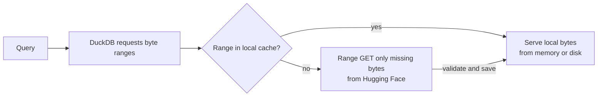

<!-- START doctoc generated TOC please keep comment here to allow auto update -->
<!-- DON'T EDIT THIS SECTION, INSTEAD RE-RUN doctoc TO UPDATE -->
**Table of Contents**  *generated with [DocToc](https://github.com/thlorenz/doctoc)*

- [Local file cache](#local-file-cache)
  - [Architecture](#architecture)
  - [What is stored](#what-is-stored)
  - [Location and lifetime](#location-and-lifetime)
  - [Network and queries](#network-and-queries)
  - [Configuration](#configuration)

<!-- END doctoc generated TOC please keep comment here to allow auto update -->

# Local file cache

DefeatBeta reads its Hugging Face dataset through a demand-driven HTTP Range
cache. DuckDB still queries the remote Parquet and JSON files; the cache stores
only bytes needed by actual reads, not complete copies of those files. The
cache is enabled by default and does not require users to select a layout.

## Architecture

The local cache stores variable-length extents instead of requiring complete
file downloads or fixed-size blocks. Cached bytes are keyed by the pinned
file and dataset version, so a new dataset version cannot reuse stale data.
Concurrent reads can share a pending download instead of issuing another
Range GET.

**Connection pool:** Cache misses use one pooled HTTP client per remote
origin, allowing files on the same origin to reuse connections and issue
concurrent requests. The client count is not a physical connection limit.
Direct access and user-configured proxies are supported. If a proxy or server closes an idle
connection, the next request opens another; status logging does not send
keepalive traffic.

## What is stored

The cache stores validated, variable-length byte ranges (extents). Extents
follow the byte ranges needed by DuckDB and Parquet column chunks; they are
not aligned to a fixed 1 MiB grid. A simple symbol query uses Parquet
row-group statistics to prefetch candidate column chunks. Other queries can
still fetch their exact missing ranges on demand. Overlapping cached or
in-flight extents are reused instead of downloaded again.

The first query for a Parquet file prepares its footer and, with column
prefetch enabled, a simple symbol scan parses row-group metadata from that
footer. The footer is stored locally; the parsed metadata is reused in memory
by later queries for any symbol in the same file. After process restart, the
metadata is parsed again from the local footer without downloading it again.
DuckDB uses a temporary metadata-only Parquet file for this parse; it is
removed immediately and is not part of the persistent cache.
File sizes come from the dataset spec when available. Other Parquet files are
prepared only when queried. No Parquet footer is downloaded merely because a
client starts.

Each cached range contains a SHA-256 digest and is published only after its
entire HTTP response has passed Range validation. A corrupt local range is
fetched again. Cache names are based on the pinned dataset file and the
dataset update version, not on the short-lived signed CDN URL.

## Location and lifetime

By default, cache files are kept flat in
`/tmp/defeatbeta/dataset-cache/<package-version>/` on macOS and Linux, or
`<system-temp>/defeatbeta/dataset-cache/<package-version>/` on Windows.
`Configuration(cache_directory=...)` can select another directory. The
project's previous `cache_httpfs` directory is separate and is not changed
by this cache.

When DefeatBeta detects a newer dataset update version, it stops reusing
bytes from the old version and removes stale cache-owned files. An occupied
file that Windows cannot remove is retried during later cleanup. Files not
recognized as cache-owned are left alone.

The default 5 GiB disk limit applies to data extents. The least recently
used data extents are evicted when new data would exceed the limit. Memory
hits also count as recent use for this decision without writing a new file.
Footer extents are retained separately from the data-extent limit. No parsed
index or file-size JSON is persisted. The in-memory data tier is bounded
independently and can be disabled. Eviction only considers cache-owned data
extents in the active flat directory; unrelated files are never removed.
This limit can currently hold the published Parquet data set, but caching is
still on demand and a larger future data set may exceed the limit.

## Network and queries

The cache works with either direct access or a configured HTTP proxy. A
connection pool can be reused across files that resolve to the same origin;
different origins receive separate pools. The client attempts a one-byte
startup connection warmup request, but does not save that byte as query data.
Remote peers and proxies may close idle connections, which are reopened on
the next request. If the cache transport fails during a query, DefeatBeta
falls back to DuckDB's standard HTTP reader for that query.

`Ticker.download_data_performance()` reports cumulative data-cache and
connection-warmup counters separately. A warm query may increase cache hits
without increasing downloaded bytes. The benchmark's per-query deltas are
more appropriate when measuring one specific query.

## Configuration

Use `Configuration(cache_enabled=False)` to disable the project cache, or
set `cache_directory`, `cache_data_disk_limit_bytes`, `cache_data_memory_limit_bytes`, and
`cache_fetch_workers` to change its resource limits. The cache stores exact missing
byte ranges as variable-length extents, up to 16 MiB each; there is no public
block-size setting. The memory tier retains at most 64 extents within its byte
budget. `cache_prepare_footer_on_first_use=False`
disables explicit footer preparation for comparison experiments, but DuckDB
still reads the metadata required by a query. `cache_symbol_column_chunk_prefetch=False`
disables column-chunk prefetch for A/B experiments while preserving the
on-demand cache and footer preparation. See
[Advanced Usage](Advanced_Usage.md) for the complete configuration table.
