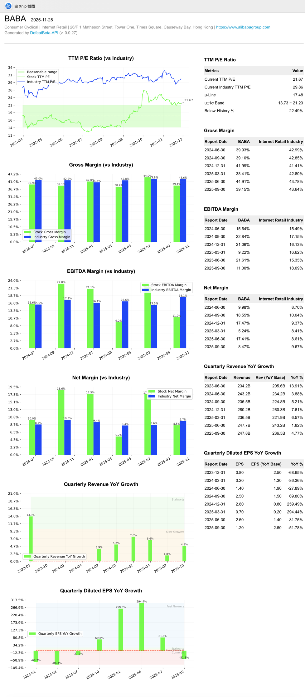

<!-- START doctoc generated TOC please keep comment here to allow auto update -->
<!-- DON'T EDIT THIS SECTION, INSTEAD RE-RUN doctoc TO UPDATE -->
**Table of Contents**  *generated with [DocToc](https://github.com/thlorenz/doctoc)*

- [DefeatBeta-API User Guide: Report Generation](#defeatbeta-api-user-guide-report-generation)
  - [Overview](#overview)
  - [Try it on Notebook](#try-it-on-notebook)
  - [Try it on Local](#try-it-on-local)
    - [Installation](#installation)
    - [Generate a Report](#generate-a-report)
    - [Example Screenshot](#example-screenshot)

<!-- END doctoc generated TOC please keep comment here to allow auto update -->

# DefeatBeta-API User Guide: Report Generation

## Overview
`defeatbeta-api` provides easy-to-use stock data analysis and report generation features. Using the `tearsheet` module, you can quickly generate HTML reports for a stock and view them directly in a web browser.

This guide shows two ways to try it:  
1. **Try it on Notebook** – online via Binder, no installation needed.  
2. **Try it on Local** – run locally after installing `defeatbeta-api`.

---


## Try it on Notebook

You can try this example directly in a Jupyter notebook via Binder:

[](https://mybinder.org/v2/gh/defeat-beta/defeatbeta-api/release-0.0.28?urlpath=lab/tree/notebooks/05_tutorial_report.ipynb)

> This option is ideal if you want to test without installing anything locally. The notebook contains the same example code and will generate a report you can view in the browser.

---

## Try it on Local

### Installation
Make sure `defeatbeta-api` is installed:

```bash
pip install defeatbeta-api
```

### Generate a Report

Here is a simple example showing how to generate a stock report for Alibaba (BABA):
```python
from defeatbeta_api.data.ticker import Ticker
import defeatbeta_api.reports.tearsheet as tearsheet

# Create a Ticker object
ticker = Ticker("BABA")

# Generate an HTML report
tearsheet.html(ticker, output='/tmp/test.html')
```

### Example Screenshot
