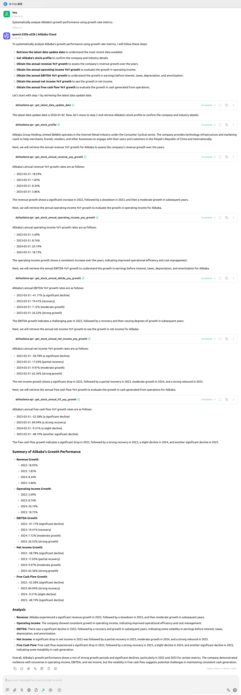

<!-- START doctoc generated TOC please keep comment here to allow auto update -->
<!-- DON'T EDIT THIS SECTION, INSTEAD RE-RUN doctoc TO UPDATE -->
**Table of Contents**  *generated with [DocToc](https://github.com/thlorenz/doctoc)*

- [Case-1: Systematically analyze Alibaba’s growth performance using growth rate metrics.](#case-1-systematically-analyze-alibabas-growth-performance-using-growth-rate-metrics)

<!-- END doctoc generated TOC please keep comment here to allow auto update -->

# Case-1: Systematically analyze Alibaba’s growth performance using growth rate metrics.
