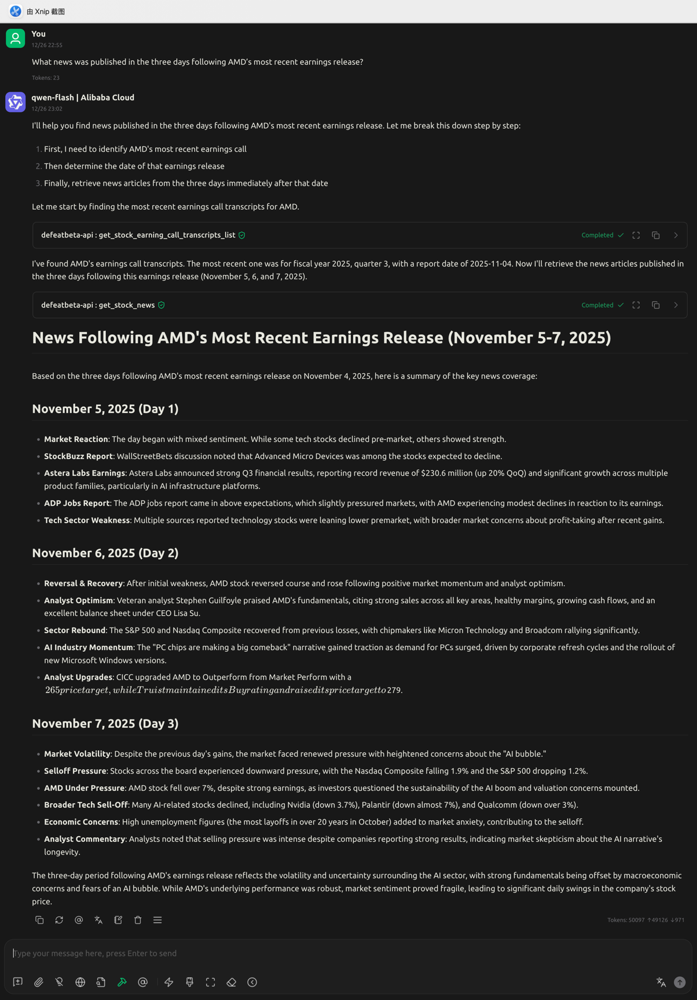
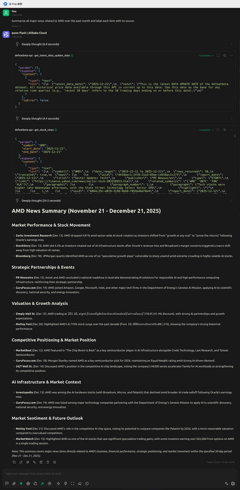

<!-- START doctoc generated TOC please keep comment here to allow auto update -->
<!-- DON'T EDIT THIS SECTION, INSTEAD RE-RUN doctoc TO UPDATE -->
**Table of Contents**  *generated with [DocToc](https://github.com/thlorenz/doctoc)*

- [Case-1: What news was published in the three days following AMD’s most recent earnings release?](#case-1-what-news-was-published-in-the-three-days-following-amds-most-recent-earnings-release)
- [Case-2: Summarize all major news related to AMD over the past month and label each item with its source.](#case-2-summarize-all-major-news-related-to-amd-over-the-past-month-and-label-each-item-with-its-source)

<!-- END doctoc generated TOC please keep comment here to allow auto update -->

# Case-1: What news was published in the three days following AMD’s most recent earnings release?

📷 Click to view example screenshot

# Case-2: Summarize all major news related to AMD over the past month and label each item with its source.

📷 Click to view example screenshot

