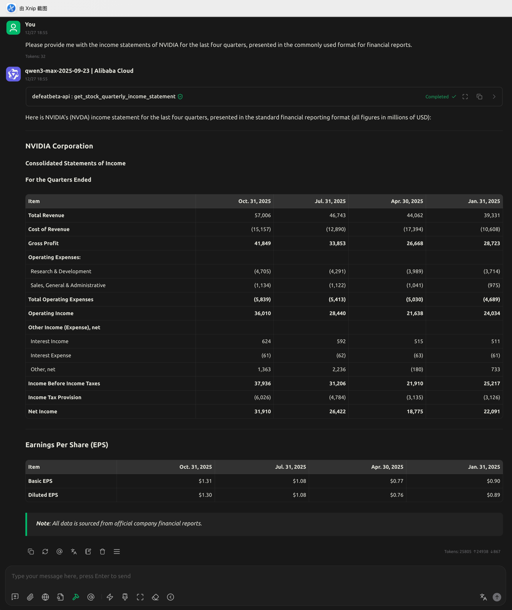
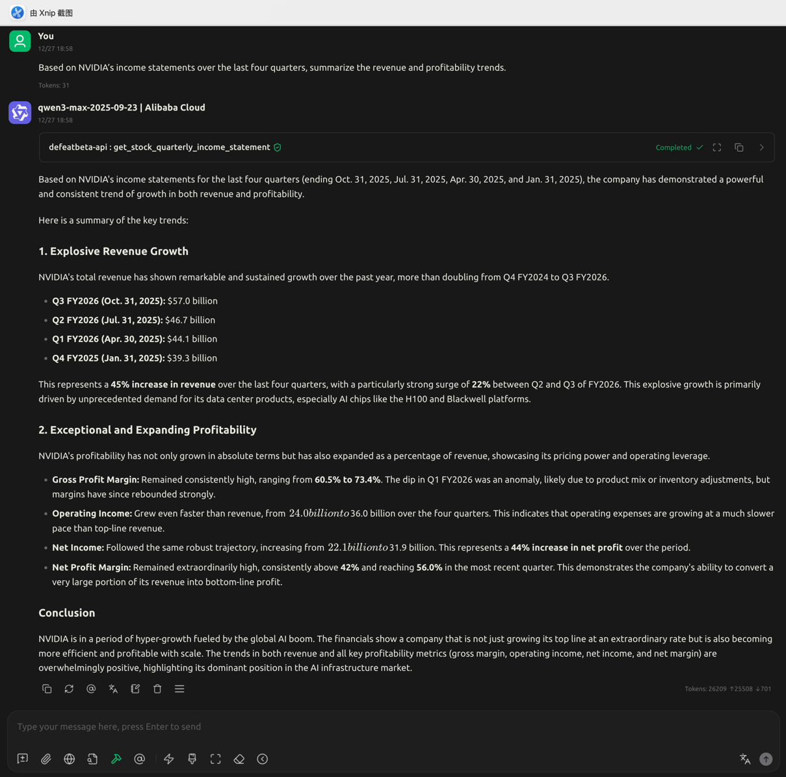
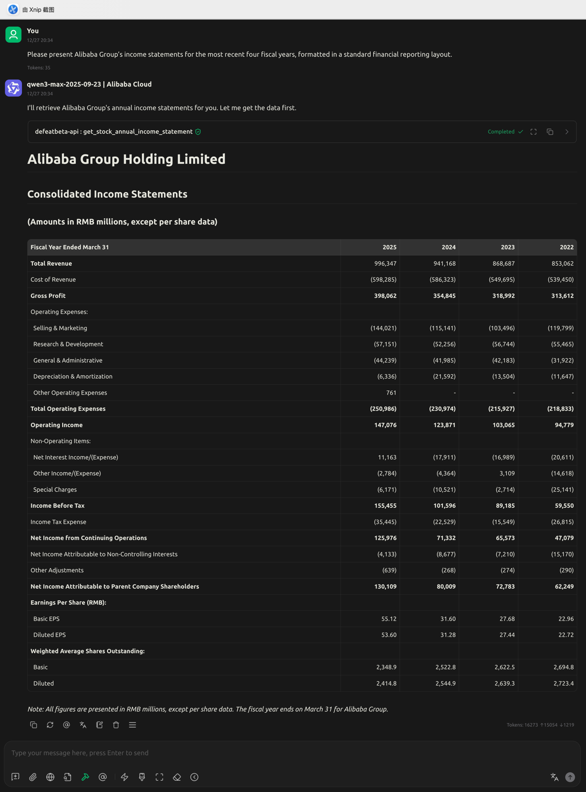

<!-- START doctoc generated TOC please keep comment here to allow auto update -->
<!-- DON'T EDIT THIS SECTION, INSTEAD RE-RUN doctoc TO UPDATE -->
**Table of Contents**  *generated with [DocToc](https://github.com/thlorenz/doctoc)*

- [Case-1: Please provide me with the income statements of NVIDIA for the last four quarters, presented in the commonly used format for financial reports.](#case-1-please-provide-me-with-the-income-statements-of-nvidia-for-the-last-four-quarters-presented-in-the-commonly-used-format-for-financial-reports)
- [Case-2: Based on NVIDIA’s income statements over the last four quarters, summarize the revenue and profitability trends.](#case-2-based-on-nvidias-income-statements-over-the-last-four-quarters-summarize-the-revenue-and-profitability-trends)
- [Case-3: Please present Alibaba Group’s income statements for the most recent four fiscal years, formatted in a standard financial reporting layout.](#case-3-please-present-alibaba-groups-income-statements-for-the-most-recent-four-fiscal-years-formatted-in-a-standard-financial-reporting-layout)

<!-- END doctoc generated TOC please keep comment here to allow auto update -->

# Case-1: Please provide me with the income statements of NVIDIA for the last four quarters, presented in the commonly used format for financial reports.

# Case-2: Based on NVIDIA’s income statements over the last four quarters, summarize the revenue and profitability trends.

# Case-3: Please present Alibaba Group’s income statements for the most recent four fiscal years, formatted in a standard financial reporting layout.
