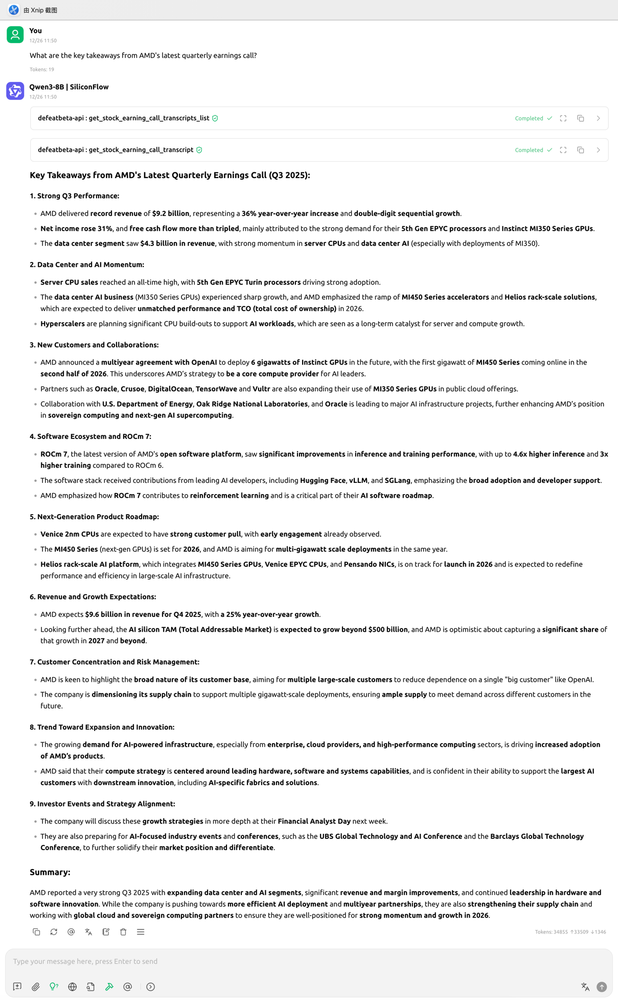
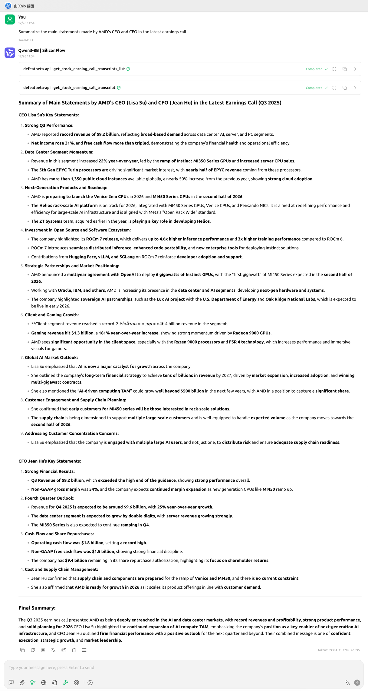
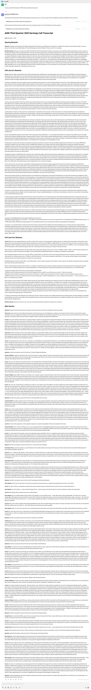
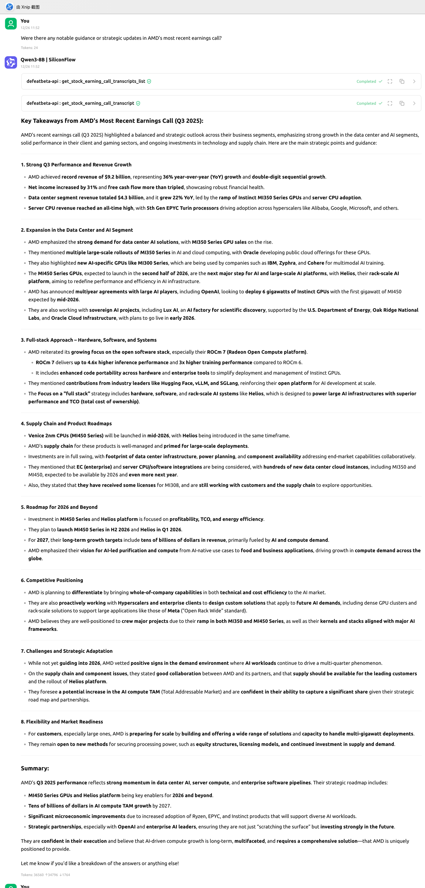

<!-- START doctoc generated TOC please keep comment here to allow auto update -->
<!-- DON'T EDIT THIS SECTION, INSTEAD RE-RUN doctoc TO UPDATE -->
**Table of Contents**  *generated with [DocToc](https://github.com/thlorenz/doctoc)*

- [Case-1: What are the key takeaways from AMD's latest quarterly earnings call?](#case-1-what-are-the-key-takeaways-from-amds-latest-quarterly-earnings-call)
- [Case-2: Summarize the main statements made by AMD’s CEO and CFO in the latest earnings call.](#case-2-summarize-the-main-statements-made-by-amds-ceo-and-cfo-in-the-latest-earnings-call)
- [Case-3: I want to see the full transcript of AMD's latest quarterly earnings call.](#case-3-i-want-to-see-the-full-transcript-of-amds-latest-quarterly-earnings-call)
- [Case-4: Were there any notable guidance or strategic updates in AMD’s most recent earnings call?](#case-4-were-there-any-notable-guidance-or-strategic-updates-in-amds-most-recent-earnings-call)

<!-- END doctoc generated TOC please keep comment here to allow auto update -->

# Case-1: What are the key takeaways from AMD's latest quarterly earnings call?

📷 Click to view example screenshot

# Case-2: Summarize the main statements made by AMD’s CEO and CFO in the latest earnings call.

📷 Click to view example screenshot

# Case-3: I want to see the full transcript of AMD's latest quarterly earnings call.

📷 Click to view example screenshot

# Case-4: Were there any notable guidance or strategic updates in AMD’s most recent earnings call?

📷 Click to view example screenshot

