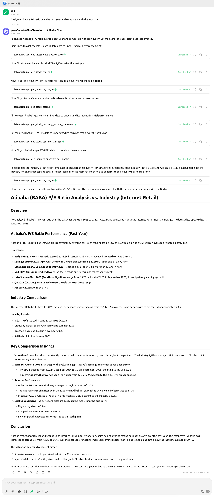
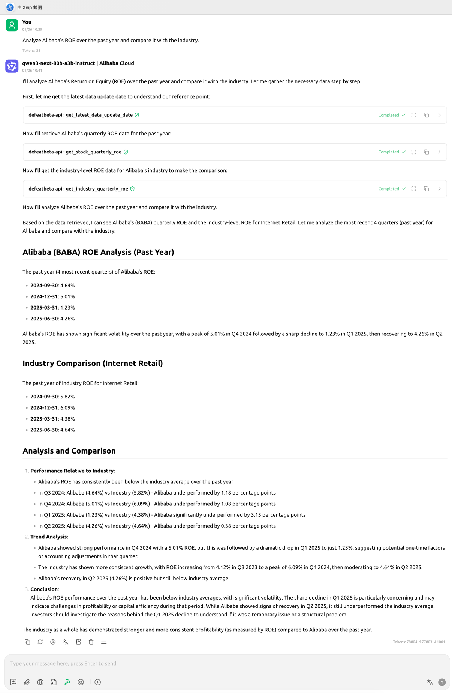
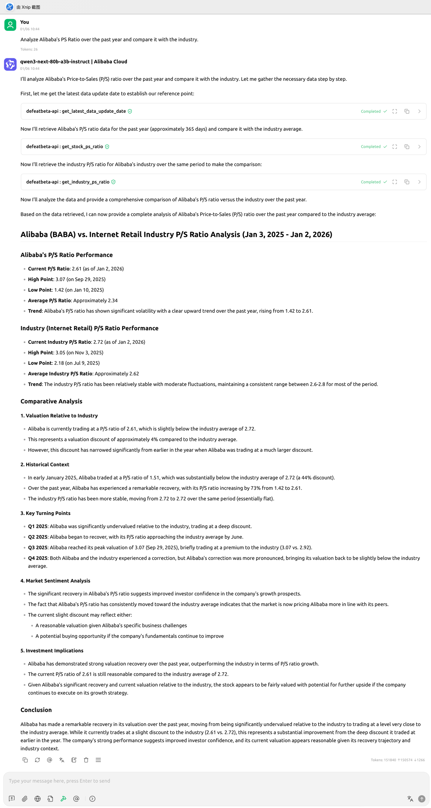

<!-- START doctoc generated TOC please keep comment here to allow auto update -->
<!-- DON'T EDIT THIS SECTION, INSTEAD RE-RUN doctoc TO UPDATE -->
**Table of Contents**  *generated with [DocToc](https://github.com/thlorenz/doctoc)*

- [Case-1: Analyze Alibaba’s P/E ratio over the past year and compare it with the industry.](#case-1-analyze-alibabas-pe-ratio-over-the-past-year-and-compare-it-with-the-industry)
- [Case-2: Analyze Alibaba’s ROE over the past year and compare it with the industry.](#case-2-analyze-alibabas-roe-over-the-past-year-and-compare-it-with-the-industry)
- [Case-3: Analyze Alibaba’s PS Ratio over the past year and compare it with the industry.](#case-3-analyze-alibabas-ps-ratio-over-the-past-year-and-compare-it-with-the-industry)
- [Case-4: Analyze Alibaba’s PB Ratio over the past year and compare it with the industry.](#case-4-analyze-alibabas-pb-ratio-over-the-past-year-and-compare-it-with-the-industry)

<!-- END doctoc generated TOC please keep comment here to allow auto update -->

# Case-1: Analyze Alibaba’s P/E ratio over the past year and compare it with the industry.

📷 Click to view example screenshot

# Case-2: Analyze Alibaba’s ROE over the past year and compare it with the industry.

📷 Click to view example screenshot

# Case-3: Analyze Alibaba’s PS Ratio over the past year and compare it with the industry.

📷 Click to view example screenshot

# Case-4: Analyze Alibaba’s PB Ratio over the past year and compare it with the industry.

📷 Click to view example screenshot

