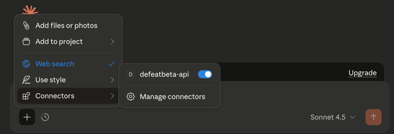
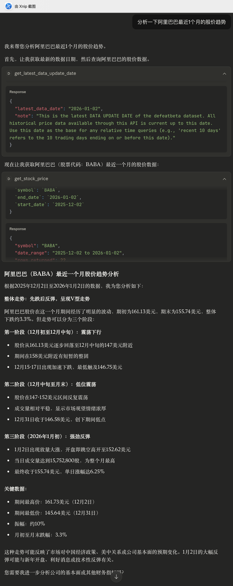
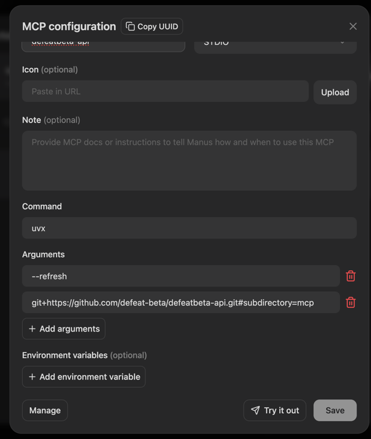
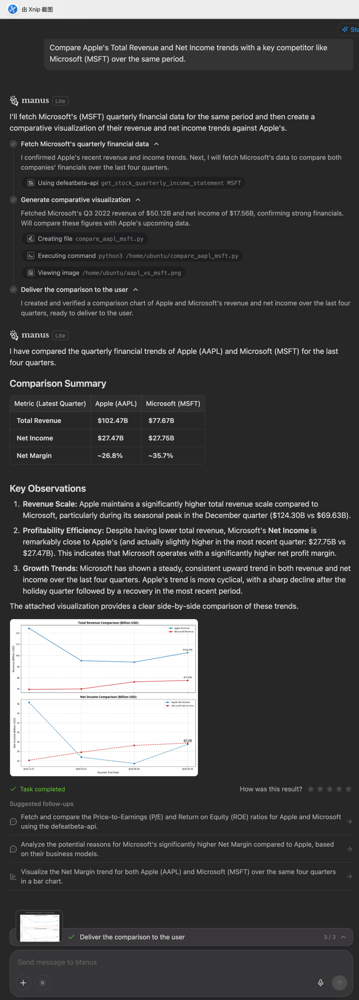

# Defeat Beta API MCP

**Defeat Beta API MCP** is an [MCP](https://modelcontextprotocol.io/introduction) server that exposes data from [defeatbeta-api](https://github.com/defeat-beta/defeatbeta-api) to large language models via standardized contextual interfaces, enabling structured and controlled financial data analysis.

Click [here](../doc/mcp/README.md) to discover more ways to use MCP and explore additional use cases and best practices.

## Overall Architecture

```text
┌──────────────────────┐
│   MCP Client         │
│  (Claude Desktop /   │
│   Manus AI /         │
│   Cherry Studio /    │
│   Other MCP Clients) │
└──────────┬───────────┘
           │  MCP (stdio)
           │  JSON-RPC
           ▼
┌──────────────────────────────┐
│   Defeat Beta API MCP Server │
│                              │
│  - MCP Tool Definitions      │
│  - Context Construction      │
│  - Windowing / Summarization │
│  - Output Shaping for LLM    │
│                              │
│  (runs in isolated .venv)    │
└──────────┬───────────────────┘
           │
           │  Python API Calls
           ▼
┌──────────────────────────────┐
│       defeatbeta-api         │
│  (Published PyPI Package)    │
│                              │
│  - Market Data Access        │
│  - Price / History / Metrics │
│                              │
└──────────┬───────────────────┘
           │
           ▼
┌──────────────────────────────┐
│   Financial Data Sources     │
│   (via defeatbeta-api)       │
└──────────────────────────────┘
```

## Installation
- Method 1: Run with uvx (Recommended)
- Method 2: One-line Install Script (Optional)

### Method 1: Run with `uvx` (Recommended)

The recommended way to run **Defeat Beta API MCP** is via `uvx`.

This method requires **no manual installation**, **no virtual environment management**, and works seamlessly with MCP-native clients such as **Manus**, **Cherry Studio**, and **Claude Desktop**.

**MCP Configuration:**

```json
{
  "mcpServers": {
    "defeatbeta-api": {
      "command": "uvx",
      "args": [
        "--refresh",
        "git+https://github.com/defeat-beta/defeatbeta-api.git#subdirectory=mcp"
      ]
    }
  }
}
```

Once added, your MCP client will automatically:
- Fetch the repository
- Resolve and cache dependencies
- Launch the MCP server in stdio mode
No further setup is required.


**Set HTTP Proxy (if you’re in a region where cannot access [the Hugging Face Dataset](https://huggingface.co/datasets/bwzheng2010/yahoo-finance-data)):**

```json
{
  "mcpServers": {
    "defeatbeta-api": {
      ...
      "env": {
        "DEFEATBETA_GATEWAY": "http://127.0.0.1:8118"
      }
    }
  }
}
```

### Method 2: One-line Install Script
#### macOS or Linux
Run script to install:
```shell
curl -sSL https://raw.githubusercontent.com/defeat-beta/defeatbeta-api/main/mcp/install | bash
```

#### What this script does

<details>
<summary>The installation script will automatically perform the following steps:</summary>


1. **Installation Location**
   * The MCP server will be installed to the local directory:
     ```text
     ~/.defeatbeta/
     ```
   * This directory contains all code and runtime resources required by the MCP server and can be safely removed to uninstall.
2. **Create an Isolated Python Virtual Environment**
   * An isolated Python virtual environment will be created at:
     ```text
     ~/.defeatbeta/.venv
     ```
   * All dependencies are installed exclusively within this environment and will not affect the system Python installation or other projects.
3. **Download and Install MCP Server Entry Scripts**
   * MCP-related files are downloaded from the `defeatbeta-api` repository.
   * The script installs and configures `mcp/run.sh` as the unified entry point for starting the MCP server.
4. **Install Runtime Dependencies**
   * Installs the MCP protocol implementation and required runtime dependencies (including `defeatbeta-api`).
   * Dependencies are resolved and installed once during installation, avoiding repeated downloads or installations at runtime.
5. **Installed Directory Structure**

> After installation, the directory structure is as follows:

```text
~/.defeatbeta/
├── .venv/                  # Isolated Python virtual environment (used by MCP Server)
│   ├── bin/
│   └── lib/
│
├── mcp/                    # MCP Server implementation
│   ├── run.sh              # MCP Server entry script (stdio mode)
│   ├── install             # Installation script (for curl | bash)
│   └── src/
│       └── defeatbeta_mcp/
│           └── server.py   # MCP Server main entry
│
└── README.md               # Local documentation
```

**Notes:**
* `run.sh`
  Serves as the single entry point to start the MCP Server, compatible with stdio-based MCP clients.
* `.venv/`
  Contains all dependencies required to run the MCP Server in an isolated environment.
* `src/defeatbeta_mcp/server.py`
  Core implementation of the MCP Server, responsible for exposing `defeatbeta-api` data as MCP tools.

</details>

## Usage
- Use in Claude Desktop
- Use in Manus

### Use in [Claude Desktop](https://claude.ai/desktop/directory)

#### 1. Add MCP Server in Claude Desktop
You can do this by looking for the “Add files, connectors, and more /”  icon:


Then follow the path:

**Connectors → Manage connectors → Developer → Edit Config**

Open the `claude_desktop_config.json` file and add the following MCP server configuration:

```json
{
  "mcpServers": {
    "defeatbeta-api": {
      "command": "uvx",
      "args": [
        "--refresh",
        "git+https://github.com/defeat-beta/defeatbeta-api.git#subdirectory=mcp"
      ]
    }
  }
}
```

After saving the file, restart **Claude for Desktop** to apply the changes.

Once the configuration is complete, hover over the **“Connectors”** menu to verify that **`defeatbeta-api`** appears in the list.



#### 2. Talk to LLM with MCP

Once the MCP Server is configured and successfully connected, you can directly ask questions to the AI in Claude, for example:

<details>
<summary>📷 Click to view example screenshot</summary>



</details>


### Use in [Manus](https://manus.im/app)

#### 1. Add MCP Server in Manus
Navigate to **Personalization center → Connectors → Add connectors → Custom MCP → Import by JSON** and add the following MCP server configuration:
```json
{
  "mcpServers": {
    "defeatbeta-api": {
      "command": "uvx",
      "args": [
        "--refresh",
        "git+https://github.com/defeat-beta/defeatbeta-api.git#subdirectory=mcp"
      ],
      "note": "An open-source alternative to Yahoo Finance's market data APIs with higher reliability.",
      "icon": "https://github.com/defeat-beta/defeatbeta-api/blob/main/doc/favicon.ico?raw=true"
    }
  }
}
```

**Once configured, the result looks like this:**



#### 2. Talk to LLM with MCP

Once the MCP Server is configured and successfully connected, you can directly ask questions to the AI in Manus, for example:

<details>
<summary>📷 Click to view example screenshot</summary>



</details>
