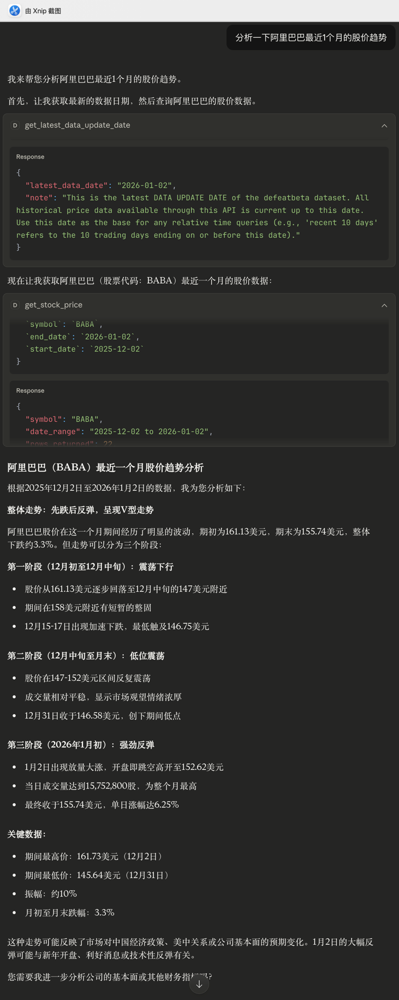
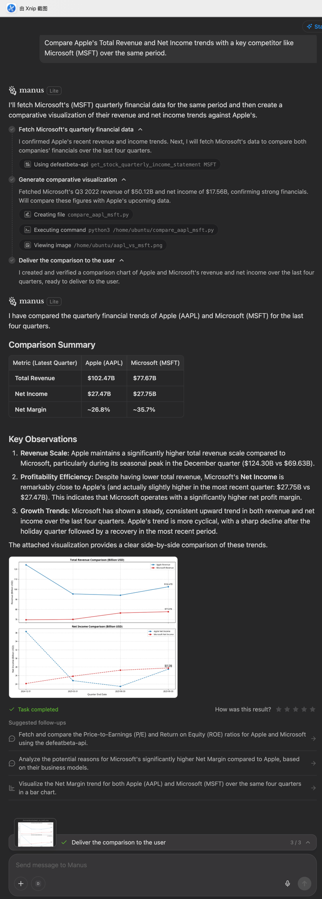

# Defeat Beta API MCP

**Defeat Beta API MCP** is an [MCP](https://modelcontextprotocol.io/introduction) server that exposes data from [defeatbeta-api](https://github.com/defeat-beta/defeatbeta-api) to large language models via standardized contextual interfaces, enabling structured and controlled financial data analysis.

Click [here](../doc/mcp/README.md) to discover more ways to use MCP and explore additional use cases and best practices.

## Overall Architecture

```text
┌──────────────────────┐
│   MCP Client         │
│  (Claude Desktop /   │
│   Manus AI /         │
│   Cherry Studio /    │
│   Other MCP Clients) │
└──────────┬───────────┘
           │  MCP (stdio)
           │  JSON-RPC
           ▼
┌──────────────────────────────┐
│   Defeat Beta API MCP Server │
│                              │
│  - MCP Tool Definitions      │
│  - Context Construction      │
│  - Windowing / Summarization │
│  - Output Shaping for LLM    │
│                              │
│  (runs in isolated .venv)    │
└──────────┬───────────────────┘
           │
           │  Python API Calls
           ▼
┌──────────────────────────────┐
│       defeatbeta-api         │
│  (Published PyPI Package)    │
│                              │
│  - Market Data Access        │
│  - Price / History / Metrics │
│                              │
└──────────┬───────────────────┘
           │
           ▼
┌──────────────────────────────┐
│   Financial Data Sources     │
│   (via defeatbeta-api)       │
└──────────────────────────────┘
```

## Installation

Defeat Beta API MCP can be installed through natural language in MCP-capable agents and clients, including **Claude Desktop**, **Manus**, **Codex**, **Hermes Agent**, **OpenClaw Agent**, and others.

Send the following message to your agent:

```text
Install the Defeat Beta API MCP from https://github.com/defeat-beta/defeatbeta-api/tree/main/mcp. Use uvx to run it, configure it for this agent, and verify that the MCP server connects successfully.
```

The agent will handle the installation and MCP configuration for you.

### Troubleshooting: Installation Timeout

The first startup may take longer while `uvx` downloads the package. If the installation or MCP connection times out, ask your agent to run the following command and then retry:

```shell
uvx --refresh "git+https://github.com/defeat-beta/defeatbeta-api.git#subdirectory=mcp"
```

### Optional: HTTP Proxy

If your environment cannot access the [Defeat Beta Yahoo Finance Dataset](https://huggingface.co/datasets/defeatbeta/yahoo-finance-data), ask your agent to configure the `DEFEATBETA_GATEWAY` environment variable for the MCP server:

```text
Configure the Defeat Beta API MCP to use my HTTP proxy by setting DEFEATBETA_GATEWAY to http://127.0.0.1:8118, then restart the MCP server and verify the connection.
```

Replace `http://127.0.0.1:8118` with your proxy address.

## Usage

After installation, ask your agent financial data questions directly. The agent will use Defeat Beta API MCP when appropriate.

Examples:

- What is Apple's latest stock price?
- Show NVIDIA's price history for the last month.
- Compare the key financial metrics of Microsoft and Google.
- Summarize Tesla's recent market performance.

<details>
<summary>📷 View a Claude Desktop example</summary>



</details>

<details>
<summary>📷 View a Manus example</summary>



</details>
