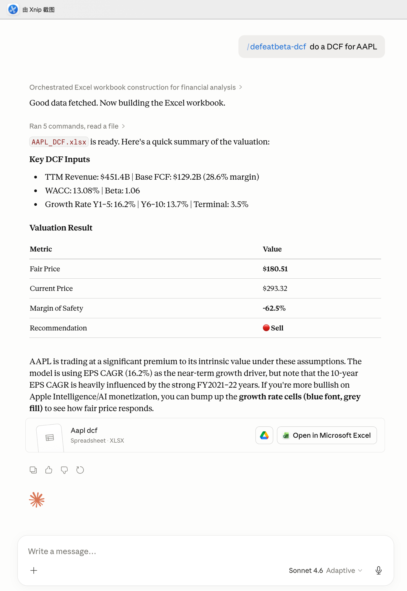
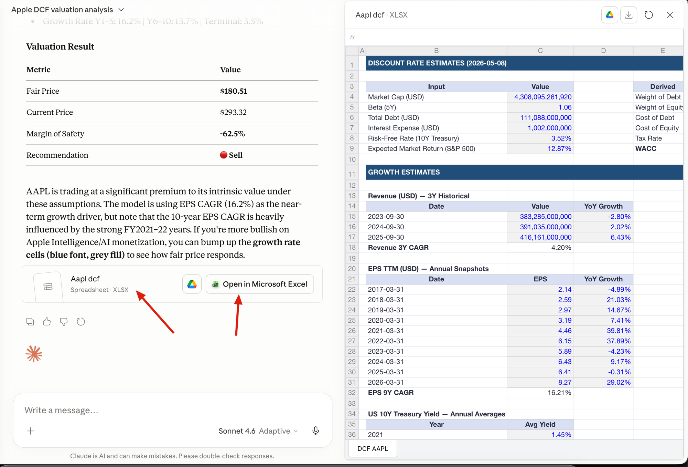

# Example: DCF Valuation for AAPL

A walkthrough of running `defeatbeta-dcf` in Claude Desktop's cowork to produce a fully-editable DCF model for Apple. The skill pulls structured DCF inputs from the `defeatbeta-api` MCP server and renders them into a single-sheet `.xlsx` whose projections, NPV, fair price, and recommendation are all live Excel formulas.

## Prompt

```
/defeatbeta-dcf do a DCF for AAPL
```

That's it. The skill takes care of: calling the MCP tool, saving the payload, running the build script, recalculating formula caches, and surfacing the file.

## What Claude returned



In the chat panel, Claude summarized:

**Key DCF Inputs**

- TTM Revenue: **$451.4B** | Base FCF: **$129.2B** (28.6% margin)
- WACC: **13.08%** | Beta: **1.06**
- Growth Rate Y1–5: **16.2%** | Y6–10: **13.7%** | Terminal: **3.5%**

**Valuation Result**

| Metric | Value |
|---|---|
| Fair Price | **$180.51** |
| Current Price | $293.32 |
| Margin of Safety | **−62.5%** |
| Recommendation | **Sell** |

## The generated Excel

The cowork preview renders the workbook in-place — no download needed to inspect it:



Four vertical sections, single sheet:

1. **Discount Rate Estimates** — Market cap, beta, debt, interest expense, risk-free rate, expected market return → derives weights, cost of debt/equity, and WACC.
2. **Growth Estimates** — 3-year historical revenue with computed 3Y CAGR, up to 10 annual EPS TTM snapshots with multi-year CAGR, and 5-year annual 10Y Treasury averages.
3. **DCF Template** — Growth rate assumptions (1–5Y, 6–10Y, terminal), discount rate, TTM revenue, base FCF, and a 10-year FCF / Terminal Value / Total Value / FCF Margin grid.
4. **DCF Valuation** — `NPV(discount_rate, Total Values year 1–10)` → equity value → fair price → margin of safety → Buy/Sell recommendation.

## Editing assumptions

The skill's value is that everything downstream of an assumption is a formula, so you can flex the model interactively. Color encoding makes editable cells obvious:

| Cell type | Background | Font color |
|---|---|---|
| Editable input | light grey `#F2F2F2` | blue `#0000FF` |
| Formula | white | black |
| Key total (WACC, Fair Price, Margin of Safety) | medium blue `#BDD7EE` | black bold |
| Section header | dark blue `#1F4E79` | white bold |

**Try this**: open the workbook in Excel or Numbers, change `C50` (Discount Rate) from `=F9` (the default WACC link) to a flat `10%`. Watch fair price in `C75` recompute, recommendation in `C78` switch, and FCF Margin row update accordingly.

Other useful cells to flex:

- `C47` — Future Growth Rate (1–5Y); defaults to capped EPS CAGR. Override to a custom near-term growth view.
- `C49` — Terminal growth rate; defaults to 5Y Treasury average.
- `C71` — Cash & ST Investments. Useful if you have a more recent balance sheet figure than the MCP snapshot.
- `C76` — Current Price; update to today's quote before re-checking margin of safety.

## Running for a different ticker

Just swap the symbol in the prompt:

```
/defeatbeta-dcf build a DCF for NVDA
/defeatbeta-dcf intrinsic value of MSFT
/defeatbeta-dcf value GOOGL
```

The skill's `description` triggers on synonyms like *DCF*, *discounted cash flow*, *intrinsic value*, *fair price*, and *value [company]*.

## Notes & caveats

- **No financials, no model.** ETFs, indices, and companies without statements (e.g. recent IPOs missing 3Y history) cause the MCP tool to return an `error` field; the skill stops and tells you instead of generating an empty workbook.
- **EPS CAGR drives the 1–5Y growth rate.** This is a heuristic — for high-growth tech this skews to the 20% cap. Always sanity-check `C47` against your own near-term view.
- **Cached preview values need LibreOffice.** The skill runs a `libreoffice --headless --calc` recalc step so previewers show numbers. If LibreOffice isn't installed locally, the workbook still opens fine in Excel / Numbers / WPS but in-platform previews show blank cells until you download it.
