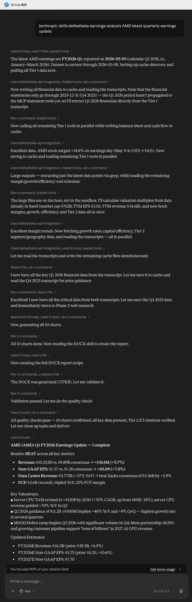

# Example: Earnings Update Report for AMD Q1 FY2026

A walkthrough of running `defeatbeta-earnings-analysis` in Claude Desktop (works equally well in chat or cowork) to produce a full sell-side style **earnings update report** — 8-12 pages, 10 embedded charts, Tier-1/2/3 cited sources — after AMD reported FY2026 Q1 results. The skill is meant for analysts who already cover the name; it updates estimates, refreshes valuation, and assesses thesis pillars against the new quarter. The screenshots below are from a chat session.

## Prompt

```
/defeatbeta-earnings-analysis AMD latest quarterly earnings update
```

That's the minimal form. The skill auto-selects the latest reported fiscal period from the DefeatBeta MCP transcripts list. A fuller prompt would also include your prior coverage (rating, PT, prior estimates, thesis pillars) so the report can write a proper "Old vs. New" comparison — see the *Update Mode* section below.

## What Claude returned



The chat walks through the workflow phases live — fetching the latest transcripts list, picking the target period (FY2026 Q1, reported 2026-05-05), setting up a cache directory, pulling Tier 1 data, running grep against the on-disk transcripts for guidance, generating 10 charts, then assembling the DOCX.

**Headline results — BEAT across all key metrics:**

- **Revenue**: $10.253B vs. $9.89B consensus → **+$363M (+3.7%)**
- **Non-GAAP EPS**: $1.37 vs. $1.28 consensus → **+$0.09 (+7.0%)**
- **Data Center Revenue**: $5.775B (+57% YoY) → beat Zacks consensus of $5.56B by +3.9%
- **FCF**: $2.6B (record), tripled YoY, 25% FCF margin

**Forward-looking takeaways extracted from the Q1 transcript:**

- Server CPU TAM revised to **>$120B by 2030** (>35% CAGR, up from $60B / 18%); server CPU revenue guided **>70% YoY in Q2**
- Q2 2026 guidance of **$11.2B ± $300M** implies +46% YoY and +9% QoQ — highest growth rate in several quarters
- MI450 / Helios ramp begins Q3 2026 with significant volume in Q4; Meta partnership (6GW) and growing customer pipeline support "tens of billions" in 2027 AI GPU revenue

**Updated estimates** (vs. analyst's prior coverage, illustrative):

- FY2026E Revenue: **$41.0B** (prior $38.5B, +6.5%)
- FY2026E Non-GAAP EPS: **$5.75** (prior $5.20, +10.6%)
- FY2027E Non-GAAP EPS: **$7.70**

## The generated DOCX

The skill's primary deliverable is a full 8-12 page sell-side style DOCX:

[**Download AMD_Q1_FY2026_Earnings_Update.docx** →](files/AMD_Q1_FY2026_Earnings_Update.docx)

It's organized as a standard sell-side update:

| Pages | Content |
|---|---|
| Page 1 | Rating + price target + 3-4 paragraph investment-impact bullets + updated estimates summary table |
| Pages 2-3 | Detailed results analysis — revenue by segment (Client / Server / DC GPU / Gaming / Embedded), margin walk, EPS reconciliation |
| Pages 4-5 | Key business metrics + management guidance (current quarter + medium-term) parsed from the Q1 earnings call |
| Pages 6-7 | Investment thesis update — each prior thesis pillar reassessed against this quarter's evidence |
| Pages 8-10 | Valuation update — DCF (delegated to the `defeatbeta-dcf` skill's underlying `get_stock_dcf_analysis` MCP tool), trading multiples, peer benchmarks, price-target walk |
| Page 11-12 | Appendix — peer comparison table, transcript highlights, complete Sources section grouped by Tier 1 / Tier 2 / Tier 3 |

10 charts are embedded throughout (quarterly revenue progression, EPS progression, margin trends, segment mix, beat/miss summary, estimate revisions, valuation bands, etc.).

## How the skill avoids hallucinating numbers

`defeatbeta-earnings-analysis` uses a **Call-Then-Write cache pattern** to keep every cited number traceable:

1. Each Tier 1 / Tier 2 MCP tool call is **immediately** followed by `Write` of the verbatim return value to `./<TICKER>_<PERIOD>/cache/<tool>.json` under the current working directory.
2. Cache files become the report's source of truth.
3. When drafting any report section, Claude `Read`s the relevant cache file before citing a number — never relying on context memory that may have been paraphrased by automatic compression.

In the AMD walkthrough above you can see Claude doing this: after pulling income statement / balance sheet / cash flow / segment data, it writes them to `./AMD_FY2026_Q1/cache/` and `grep`s against the on-disk transcript for guidance quotes instead of pulling the entire 60K-char transcript back into context.

## Running for a different ticker

```
/defeatbeta-earnings-analysis NVDA Q1 FY2026 earnings update
/defeatbeta-earnings-analysis Analyze MSFT's latest quarterly results
/defeatbeta-earnings-analysis TSM post-earnings report for the latest quarter
```

The skill picks up the latest fiscal period from MCP automatically, or matches a user-specified `Q[X] FY[YYYY]` against the transcripts list.

## Update Mode — include your prior coverage for "Old vs. New"

If you provide your prior estimates, rating, and price target, the report writes the standard sell-side `MAINTAIN / RAISE / LOWER` rating action with Old / New / Change columns in the estimates table:

```
/defeatbeta-earnings-analysis AMD latest quarterly earnings update.

Our prior coverage (from Q4 FY2025 update, dated February 2026):
  Rating: Overweight
  Price Target: $185
  FY2026E Revenue: $38.5B; Non-GAAP EPS: $5.20; Op margin: 24%

Three thesis pillars to re-assess against Q1 results:
  1. Data Center GPU ramp (MI300 / MI325X / MI450) closes the inference gap with Nvidia
  2. Server CPU share gains continue against Intel
  3. Client + Embedded stabilize after the FY2024 trough

Update estimates, assess each thesis pillar, decide whether to maintain /
raise / lower the rating and PT.
```

Without prior coverage, the report still proceeds — beat/miss is computed against consensus only, and the "Old" columns become "N/A" (no number fabrication).

## Notes & caveats

- **Transcript must exist for the target fiscal period.** If the company just reported within minutes and DefeatBeta hasn't ingested the transcript yet, the MCP transcript list won't include it. Try again later or pass an explicit prior `FY` / `Q` if you want to analyze the previous quarter.
- **Cache files live under your cwd.** In cowork, that's the session workspace — you'll see `./<TICKER>_<PERIOD>/cache/` appear in the file tree as the skill runs, with one file per data domain. Same convention as `defeatbeta-dcf`.
- **Charts need a Python environment.** The skill uses matplotlib / pandas / seaborn to render 8-12 charts as PNGs embedded into the DOCX. If charts can't be rendered, the report still ships with text + tables but the analyst loses the visual progression aids.
- **DOCX-creation skill required.** The skill relies on a DOCX-creation skill (Anthropic's "Office Document Creator" or equivalent). Without it, falls back to Markdown output.
- **Tier 1 is MCP-only.** Reported financials and transcripts come strictly from the DefeatBeta MCP server; the skill will *not* patch missing T1 data from web search or 10-Q filings. Web sources are reserved for Tier 2 fallback (segment / geography where MCP is empty) and all Tier 3 data (consensus, analyst PT, operating metrics, options-implied move).
