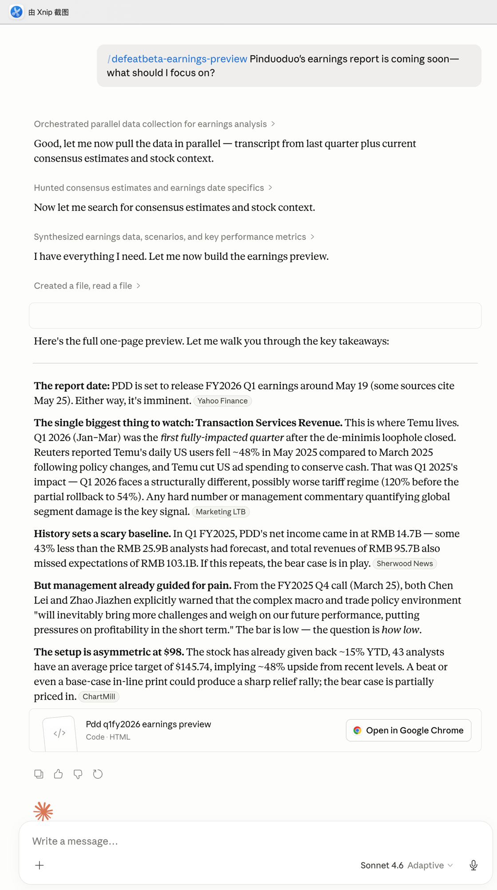
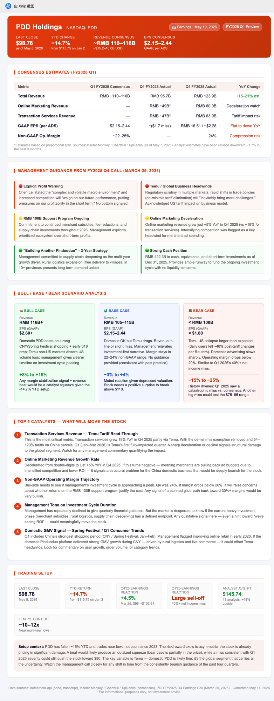

# Example: Earnings Preview for Pinduoduo (PDD)

A walkthrough of running `defeatbeta-earnings-preview` in Claude Desktop's cowork to produce a one-page pre-earnings briefing for Pinduoduo Holdings ahead of its FY2026 Q1 print. The skill pulls the prior-quarter earnings-call transcript from the `defeatbeta-api` MCP server, gathers consensus estimates and stock context via web search, then synthesizes a structured preview with bull/base/bear scenarios, a catalyst checklist, and a trading setup.

## Prompt

```
/defeatbeta-earnings-preview Pinduoduo's earnings report is coming soon — what should I focus on?
```

The skill orchestrates several steps in parallel: pulling the most recent transcript (FY2025 Q4 call, March 25, 2026) for management guidance, hunting consensus estimates and the earnings date via web search, then synthesizing everything into a one-page HTML preview.

## What Claude returned



Claude walked through the high-level takeaways inline:

- **Report date**: PDD set to release FY2026 Q1 around **May 19** (some sources cite May 25). Imminent either way.
- **The single biggest thing to watch — Transaction Services Revenue.** Q1 2026 (Jan–Mar) was the *first fully-impacted quarter* after the de-minimis loophole closed; Reuters reported Temu's daily US users fell ~48% in May 2025 vs March 2025. Any hard number quantifying global segment damage is the key signal.
- **History sets a scary baseline.** In Q1 FY2025, PDD's net income came in at RMB 14.7B — 43% below the RMB 25.9B consensus, on revenue of RMB 95.7B vs RMB 103.1B expected. If this repeats, the bear case is in play.
- **Management already guided for pain.** From the FY2025 Q4 call (March 25), both Chen Lei and Zhao Jiazhen explicitly warned the macro/trade environment "will inevitably bring more challenges and weigh on our future performance, putting pressures on profitability in the short term."
- **The setup is asymmetric at $98.** Stock has given back ~15% YTD; 43 analysts have an average price target of $145.74 (~48% upside). A beat or even a base-case in-line print could produce a sharp relief rally; the bear case is partially priced in.

Inline citations link back to the original sources (Yahoo Finance, Reuters/Marketing LTB, Sherwood News, ChartMill).

## The generated HTML report

Beyond the chat summary, Claude produced a standalone one-page HTML preview embedded with all the structured analysis:



The report is organized into five sections:

1. **Consensus Estimates Table** — Total Revenue, segment splits (Online Marketing / Transaction Services), GAAP EPS, and Non-GAAP operating margin, each with prior-quarter actuals and YoY directional flags.
2. **Management Guidance from FY2025 Q4 Call** — Extracted directly from the defeatbeta MCP transcript tool: explicit profit warning, Temu/global headwinds, the RMB 100B merchant support program, online marketing deceleration, the "Building Another Pinduoduo" 3-year strategy, and cash position. Each item is color-coded (red = bearish signal, yellow = mixed, green = supportive).
3. **Bull / Base / Bear Scenario Analysis** — Three columns with revenue ranges, EPS ranges, narrative, and expected stock reaction (e.g. Bull: RMB 116B+ revenue, EPS $2.60+, +8% to +15% reaction).
4. **Top 5 Catalysts** — Ranked list of what will move the stock, with the rationale for each: Transaction Services tariff read-through, Online Marketing growth rate, Non-GAAP operating margin trajectory, management tone on investment-cycle duration, domestic GMV / Spring Festival signal.
5. **Trading Setup** — Last close, YTD return, recent reaction history (Q4'25: +4.5%, Q1'25: large sell-off on -40% net income miss), analyst average price target with implied upside, TTM P/E context.

A trailing "Setup context" paragraph at the bottom ties everything together with the risk/reward read.

## Running for a different ticker

The skill triggers on a variety of phrasings; just name the company or include the quarter:

```
/defeatbeta-earnings-preview What should I watch for NVDA Q1 next week?
/defeatbeta-earnings-preview Preview Alibaba's upcoming earnings
/defeatbeta-earnings-preview Build a pre-earnings note for SHOP
```

Behind the scenes the skill always pulls the prior-quarter transcript from the `defeatbeta-api` MCP server using `get_stock_earning_call_transcripts_list` + `get_stock_earning_call_transcript`, so the management guidance section is grounded in actual call commentary rather than secondhand summaries.

## Notes & caveats

- **Transcripts must exist.** If the MCP transcript tools return nothing for the ticker (newly public company, niche listing), the skill calls out the data gap rather than substituting web search for management guidance.
- **Consensus estimates change.** Always note the source/date of estimates — the skill cites them inline. Whisper numbers from buy-side surveys are often more relevant than published consensus.
- **Scenario reactions are calibrated, not predicted.** The bull/base/bear stock-reaction ranges are derived from historical reaction patterns to similar prints; they help set expectations, not lock them in.
- **Options-implied move is worth comparing.** The skill doesn't pull options data; if you want to gauge whether the market's expected move is wider or tighter than the scenarios suggest, check the options chain separately.
